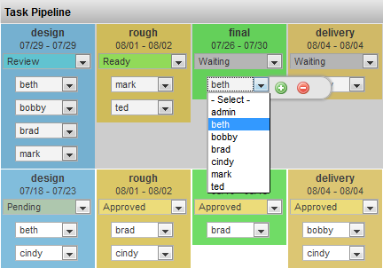
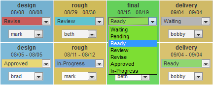

# Task Status Edit

**Description**

The Task Status Edit column is used to display the status of all tasks
for the item. It also provides conveniences such as changing the status
of the task and the assigned user.

**Info**

<table>
<colgroup>
<col width="28%" />
<col width="71%" />
</colgroup>
<tbody>
<tr class="odd">
<td>
<strong>Name</strong>
</td>
<td>
Task Element Widget
</td>
</tr>
<tr class="even">
<td>
<strong>Common Title</strong>
</td>
<td>
Task Status Edit
</td>
</tr>
<tr class="odd">
<td>
<strong>Class</strong>
</td>
<td>
tactic.ui.table.TaskElementWdg
</td>
</tr>
<tr class="even">
<td>
<strong>Category</strong>
</td>
<td>
Common Columns
</td>
</tr>
<tr class="odd">
<td>
<strong>TACTIC Version Support</strong>
</td>
<td>
3.0.0 

</td>
</tr>
<tr class="even">
<td>
<strong>Required database columns</strong>
</td>
<td>
none
</td>
</tr>
</tbody>
</table>

**Usage**

Once this column is added into the view, the drop down list can be used
to change the status. In addition, this column also displays the
process, schedule and the assigned user.

**Implementation**

This widget can be added using the Column Manager and can be found under
the common columns as **Task Status Edit**.

**Color**

TACTIC provides the ability to assign each status its own color. Setting
colors is handles from the Project Workflow (Pipeline) editor. Each
process in a regular pipeline or a status pipeline can be assigned a
color which will be used in this widget.

<table>
<colgroup>
<col width="30%" />
<col width="69%" />
</colgroup>
<tbody>
<tr class="odd">
<td>
<strong>Bg Color</strong>
</td>
<td>
<strong>status</strong> and <strong>process</strong>. Set what controls the background color of the task. <strong>Status</strong> sets the task color to be the same as the status color. <strong>Process</strong> mode sets the task color to be the same color of the process as set in the Workflow Editor.
</td>
</tr>
<tr class="even">
<td>
<strong>Status Color</strong>
</td>
<td>
<strong>status</strong> and <strong>process</strong>. Set what controls the background color of the status drop down. <strong>Status</strong> sets the status drop down color to be the same as the status color. <strong>Process</strong> mode sets the status drop down color to be the same color of the process as set in the Workflow Editor.
</td>
</tr>
<tr class="odd">
<td>
<strong>Context Color</strong>
</td>
<td>
<strong>status</strong> and <strong>process</strong>. Set what controls the background color of the context grid. <strong>Status</strong> sets the context grid color to be the same as the status color. <strong>Process</strong> mode sets the context grid color to be the same color of the process as set in the Workflow Editor.
</td>
</tr>
<tr class="even">
<td>
<strong>Text Color</strong>
</td>
<td>
Specifies the color of the task text using a color swatch.
</td>
</tr>
<tr class="odd">
<td>
<strong>Show Process</strong>
</td>
<td>
<strong>True</strong> or <strong>false</strong>. Displays the process of the task within the column.
</td>
</tr>
<tr class="even">
<td>
<strong>Show Context</strong>
</td>
<td>
<strong>True</strong> or <strong>false</strong>. Displays the context of the task within the column.
</td>
</tr>
<tr class="odd">
<td>
<strong>Show Dates</strong>
</td>
<td>
<strong>True</strong> or <strong>false</strong>. Displays the time frame for the task. The schedule will display the start and end date.
</td>
</tr>
<tr class="even">
<td>
<strong>Show Assigned</strong>
</td>
<td>
<strong>True</strong> or <strong>false</strong>. Displays the assigned user to the task.
</td>
</tr>
<tr class="odd">
<td>
<strong>Show Track</strong>
</td>
<td>
<strong>True</strong> or <strong>false</strong>.. Displays a button on each task which displays the last status and the user who changed it.
</td>
</tr>
<tr class="even">
<td>
<strong>Show Labels</strong>
</td>
<td>
<strong>True</strong> or <strong>false</strong>. Displays the label of the pipeline’s process.
</td>
</tr>
<tr class="odd">
<td>
<strong>Show Border</strong>
</td>
<td>
<strong>all</strong>, <strong>one-sided</strong>, <strong>none</strong>. <strong>All</strong> displays a border around each task. <strong>One-sided</strong> displays a border around one one side of the task. <strong>None</strong> hides the border.
</td>
</tr>
<tr class="even">
<td>
<strong>Show Current Pipeline Only</strong>
</td>
<td>
<strong>True</strong> or <strong>false</strong>. Displays tasks for the current pipeline only.
</td>
</tr>
<tr class="odd">
<td>
<strong>Show Task Edit</strong>
</td>
<td>
<strong>True</strong> or <strong>false</strong>. Displays a button which pops-up a window to edit the task info.
</td>
</tr>
<tr class="even">
<td>
<strong>Task Edit view</strong>
</td>
<td>
Specify the Task view by which to edit the task information.
</td>
</tr>
<tr class="odd">
<td>
<strong>Task Filter</strong>
</td>
<td>
<strong>panel</strong>, <strong>vertical</strong>, <strong>horizontal</strong>: Layout orientation to display the list of tasks.
</td>
</tr>
<tr class="even">
<td>
<strong>Layout</strong>
</td>
<td>
<strong>context only</strong> or <strong>process only</strong>: Displays only tasks for either the context or the process.
</td>
</tr>
<tr class="odd">
<td>
<strong>Edit Status</strong>
</td>
<td>
<strong>True</strong> or <strong>false</strong>. Allows the user to open the status drop down selection box for the status to change it.
</td>
</tr>
<tr class="even">
<td>
<strong>Edit Assigned</strong>
</td>
<td>
<strong>True</strong> or <strong>false</strong>. Allows the user to open the status drop down selection box for the assigned user to change it.
</td>
</tr>
</tbody>
</table>

**Advanced**

    <element name='task_status_edit'>
      <display class='tactic.ui.table.TaskElementWdg'>
        <show_context>true</show_context>
        <show_assigned>true</show_assigned>
        <show_dates>true</show_dates>
        <edit>true</edit>
      </display>
      <action class='tactic.ui.table.TaskElementCbk'/>
    </element>
