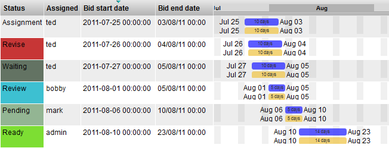

# Task Schedule

**Description**

The Task Schedule displays a horizontal bar graph representing the
schedule of start/end date and duration for all tasks assigned to an
item. This widget is a simple pre-configuration of the Gantt Chart
widget.

**Info**

<table>
<colgroup>
<col width="28%" />
<col width="71%" />
</colgroup>
<tbody>
<tr class="odd">
<td>
<strong>Name</strong>
</td>
<td>
Task Schedule
</td>
</tr>
<tr class="even">
<td>
<strong>Class</strong>
</td>
<td>
tactic.ui.table.GanttElementWdg
</td>
</tr>
<tr class="odd">
<td>
<strong>Category</strong>
</td>
<td>
Common Columns
</td>
</tr>
<tr class="even">
<td>
<strong>TACTIC Version Support</strong>
</td>
<td>
3.0+
</td>
</tr>
<tr class="odd">
<td>
<strong>Required database columns</strong>
</td>
<td>
none
</td>
</tr>
</tbody>
</table>

**Implementation**

The Task Schedule Widget is a common column that can be added using the
Column Manager.

**Options**

The following is the configuration option which the makes this widget
distinct from its derivative, the Gantt Chart widget.

    [
            {
              "start_date_expr":  "@MIN(sthpw/task.bid_start_date)",
              "end_date_expr":    "@MAX(sthpw/task.bid_end_date)",
              "color":            "#33F",
              "edit":             "true",
              "default":          "false"
            },
            {
              "start_date_expr":  "@MIN(sthpw/task['context','model'].bid_start_date)",
              "end_date_expr":    "@MAX(sthpw/task['context','model'].bid_end_date)",
              "color":            "#F0C956",
              "edit":             "true",
              "default":          "false"
            }
            ]

<table>
<colgroup>
<col width="28%" />
<col width="71%" />
</colgroup>
<thead>
<tr class="header">
<th><strong>Show Title</strong></th>
<th><strong>True</strong> or <strong>False</strong> Display the title in the column header.</th>
</tr>
</thead>
<tbody>
<tr class="odd">
<td>
<strong>Date Mode</strong>
</td>
<td>
<strong>visible</strong>, <strong>hover</strong> Always display the start/end date next to the horizontal bar or display the dates only on cursor hover.
</td>
</tr>
<tr class="even">
<td>
<strong>Range Start Date</strong>
</td>
<td>
Select the start date range for the tasks to display.
</td>
</tr>
<tr class="odd">
<td>
<strong>Range End Date</strong>
</td>
<td>
Select the end date range for the tasks to display.
</td>
</tr>
<tr class="even">
<td>
<strong>Show Milestones</strong>
</td>
<td>
<strong>task</strong>, <strong>project</strong> Display a red vertical bar representing the milestone for the task or the project
</td>
</tr>
<tr class="odd">
<td>
<strong>Year Display</strong>
</td>
<td>
<strong>none</strong>, <strong>default</strong> Display the year in the column header.
</td>
</tr>
<tr class="even">
<td>
<strong>Week Display</strong>
</td>
<td>
<strong>none</strong>, <strong>default</strong> Display the week in the column header.
</td>
</tr>
</tbody>
</table>

**Advanced**

    <element name="task_schedule">
      <display class="tactic.ui.table.GanttElementWdg">
        <options>[
            {
              "start_date_expr":  "@MIN(sthpw/task.bid_start_date)",
              "end_date_expr":    "@MAX(sthpw/task.bid_end_date)",
              "color":            "#33F",
              "edit":             "true",
              "default":          "false"
            },
            {
              "start_date_expr":  "@MIN(sthpw/task['context','model'].bid_start_date)",
              "end_date_expr":    "@MAX(sthpw/task['context','model'].bid_end_date)",
              "color":            "#F0C956",
              "edit":             "true",
              "default":          "false"
            }
            ]</options>
      </display>
      <action class="tactic.ui.table.GanttCbk">
        <sObjects>@SOBJECT(sthpw/task)</sObjects>
        <options>[
            {
              "prefix":           "bid",
              "sObjects":         "@SOBJECT(sthpw/task)",
              "mode":             "cascade"
            },
            {
              "prefix":           "bid",
              "sObjects":         "@SOBJECT(sthpw/task['context','model'])",
              "mode":             "cascade"
            }

            ]</options>
      </action>
    </element>
