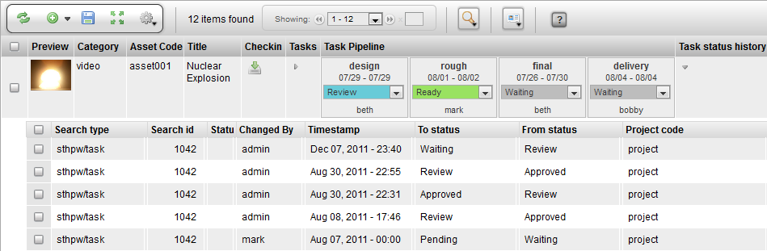

# Task Status History

**Description**

The Task Status History is a toggle that opens a hidden row that
displays all the status changes for an item. If there are multiple
processes for an item, the status updates for those processes will be
displayed.

**Info**

<table>
<colgroup>
<col width="28%" />
<col width="71%" />
</colgroup>
<tbody>
<tr class="odd">
<td>
<strong>Name</strong>
</td>
<td>
Task Status History
</td>
</tr>
<tr class="even">
<td>
<strong>Class</strong>
</td>
<td>
tactic.ui.panel.TableLayoutWdg
</td>
</tr>
<tr class="odd">
<td>
<strong>Category</strong>
</td>
<td>
Common Columns
</td>
</tr>
<tr class="even">
<td>
<strong>TACTIC Version Support</strong>
</td>
<td>
3.0+
</td>
</tr>
<tr class="odd">
<td>
<strong>Required database columns</strong>
</td>
<td>
none
</td>
</tr>
</tbody>
</table>

**Implementation**

The Task Edit Widget is a common column that can be added using the
Column Manager.

**Options**

There are no options provided for the Task Edit Widget.

**Advanced**

    <element name="task_status_history">
      <display class="HiddenRowToggleWdg">
        <dynamic_class>tactic.ui.panel.TableLayoutWdg</dynamic_class>
        <search_type>sthpw/status_log</search_type>
        <view>table</view>
        <expression>@SOBJECT(sthpw/task.sthpw/status_log)</expression>
        <mode>simple</mode>
      </display>
    </element>
