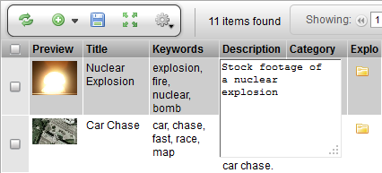

# Text Area

**Description**

The TextAreaWdg is a simple text widget which is used for editing
full-text. The widget supports using the ENTER key for adding new lines
(the ENTER key is often not supported on text entry widgets where
CTRL+ENTER is used.) This widget can also be configured to display a
larger canvas to work on.

**Info**

<table>
<colgroup>
<col width="30%" />
<col width="69%" />
</colgroup>
<thead>
<tr class="header">
<th><strong>Name</strong></th>
<th>TextAreaWdg</th>
</tr>
</thead>
<tbody>
<tr class="odd">
<td>
<strong>Class</strong>
</td>
<td>
pyasm.widget.TextAreaWdg
</td>
</tr>
<tr class="even">
<td>
<strong>TACTIC Version Support</strong>
</td>
<td>
2.5.0 

</td>
</tr>
<tr class="odd">
<td>
<strong>Required database columns</strong>
</td>
<td>
requires a database column for storing the text data.
</td>
</tr>
</tbody>
</table>

**Implementation**

The TextAreaWdg is used in Edit scenarios where full text input is
required. There is control for the columns (characters across) and rows
(characters down).

**Options**

<table>
<colgroup>
<col width="28%" />
<col width="71%" />
</colgroup>
<tbody>
<tr class="odd">
<td>
<strong>cols</strong>
</td>
<td>
The number of character columns in the TextArea
</td>
</tr>
<tr class="even">
<td>
<strong>rows</strong>
</td>
<td>
The number of character rows in the TextArea
</td>
</tr>
</tbody>
</table>

**Advanced**

The following example is a default implementation. The default number of
cols is **50** and the default number of rows is **3**.

    <element name="subject">
      <display class="TextAreaWdg"/>
    </element>

The following example creates a large text area which could be used for
writing large amounts of full-text.

    <element name="summary">
      <display class="TextAreaWdg">
        <cols>100</cols>
        <rows>30</rows>
      </display>
    </element>
