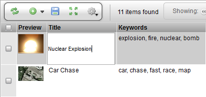

# Text Input

**Description**

The TextWdg is a basic form element in which a single line of text can
be entered. (To enter multiple lines, use the TextAreaWdg instead.) It
maps directly to the HTML text input. It can be used independently or as
an edit element in the TableLayoutWdg or EditWdg.

**Info**

<table>
<colgroup>
<col width="28%" />
<col width="71%" />
</colgroup>
<tbody>
<tr class="odd">
<td>
<strong>Name</strong>
</td>
<td>
Text Input
</td>
</tr>
<tr class="even">
<td>
<strong>Class</strong>
</td>
<td>
pyasm.widget.TextWdg
</td>
</tr>
<tr class="odd">
<td>
<strong>TACTIC Version Support</strong>
</td>
<td>
2.5.0 

</td>
</tr>
<tr class="even">
<td>
<strong>Required database columns</strong>
</td>
<td>
none
</td>
</tr>
</tbody>
</table>

**Implementation**

Basic example of a typical usage of a TextWdg

**Options**

<table>
<colgroup>
<col width="28%" />
<col width="71%" />
</colgroup>
<thead>
<tr class="header">
<th><strong>size</strong></th>
<th>Determine the width of the text widget. Default is &quot;50&quot;.</th>
</tr>
</thead>
<tbody>
<tr class="odd">
<td>
<strong>read_only</strong>
</td>
<td>
true
</td>
</tr>
</tbody>
</table>

**Advanced**

Simple example which displays text widget that is fully editable:

    <element name='first_name'>
      <display class='pyasm.widget.TextWdg'/>
    </element>

A text widget that only allows integer input. The size is reduced to 5.

    <element name='age'>
      <display class='pyasm.widget.TextWdg'>
        <size>5</size>
      </display>
    </element>

A simple example of the TextWdg in Python:

    from pyasm.widget import TextWdg

    div = DivWdg()
    text_wdg = TextWdg("age")
    text_wdg.set_option("size", "20")
    div.add(text_wdg)
