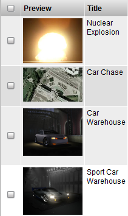

# Preview

**Description**

The Thumbnail Widget is available for most types by default as the
preview tool for images which have been uploaded for preview and
thumbnail purposes. An icon for the corresponding file type is displayed
for non-image files.

**Info**

<table>
<colgroup>
<col width="28%" />
<col width="71%" />
</colgroup>
<tbody>
<tr class="odd">
<td>
<strong>Name</strong>
</td>
<td>
Thumbnail Widget
</td>
</tr>
<tr class="even">
<td>
<strong>Common Title</strong>
</td>
<td>
Preview, Snapshot, Files
</td>
</tr>
<tr class="odd">
<td>
<strong>TACTIC Version Support</strong>
</td>
<td>
2.5.0 

</td>
</tr>
<tr class="even">
<td>
<strong>Required database columns</strong>
</td>
<td>
none
</td>
</tr>
</tbody>
</table>

**Implementation**

The Thumbnail widget is available in the common columns.

**Options**

<table>
<colgroup>
<col width="28%" />
<col width="71%" />
</colgroup>
<tbody>
<tr class="odd">
<td>
<strong>script_path</strong>
</td>
<td>
Specify a script to control what UI it draws or what happens when the user click on the preview icon. Refer to it by this script path.
</td>
</tr>
<tr class="even">
<td>
<strong>detail_class_name</strong>
</td>
<td>
Specify the default behavior to open up a pop-up window but just with a different widget written in Python.
</td>
</tr>
<tr class="odd">
<td>
<strong>icon_context</strong>
</td>
<td>
The context that the widget displays
</td>
</tr>
<tr class="even">
<td>
<strong>icon_size</strong>
</td>
<td>
Control the icon size by percentage (up to 100%) e.g. 30%
</td>
</tr>
<tr class="odd">
<td>
<strong>min_icon_size</strong>
</td>
<td>
Minimum icon size (in pixels).
</td>
</tr>
<tr class="even">
<td>
<strong>latest_icon</strong>
</td>
<td>
If set to 'true', the icon displayed corresponds to the latest checkin in the checkin history. It will disregard the icon context designated for this search type.
</td>
</tr>
<tr class="odd">
<td>
<strong>filename</strong>
</td>
<td>
If set to 'true', the file name of the linked file is displayed under the icon.
</td>
</tr>
<tr class="even">
<td>
<strong>original</strong>
</td>
<td>
If set to 'true', the link will point to the original file with the 'main' file type checked in. Otherwise the scaled down 'web' version of the file will be linked. This is only applicable to image-type files where an icon has been generated during a check-in.
</td>
</tr>
<tr class="odd">
<td>
<strong>file_type</strong>
</td>
<td>
Whether to display the file type for download or not.
</td>
</tr>
<tr class="even">
<td>
<strong>detail</strong>
</td>
<td>
If set to 'false', clicking of the thumbnail will link the underlying picture instead of displaying the single asset view in a pop-up
</td>
</tr>
<tr class="odd">
<td>
<strong>protocol</strong>
</td>
<td>
'http'(default) or 'file'. The protocol under which the thumbnail link will open when being clicked on. When 'file' is set, the default application is usually Windows explorer or at times Internet Explorer. 'file' mode can alleviate the bandwidth usage on the web server when viewing large media files like Quick Time.
</td>
</tr>
<tr class="even">
<td>
<strong>redirect_expr</strong>
</td>
<td>
Works similarly as the redirect but in the form of expression. e.g. @SOBJECT(prod/sequence). If this display option is set for the ThumbWdg for prod/shot, it will display the icon of its sequence instead.
</td>
</tr>
</tbody>
</table>

