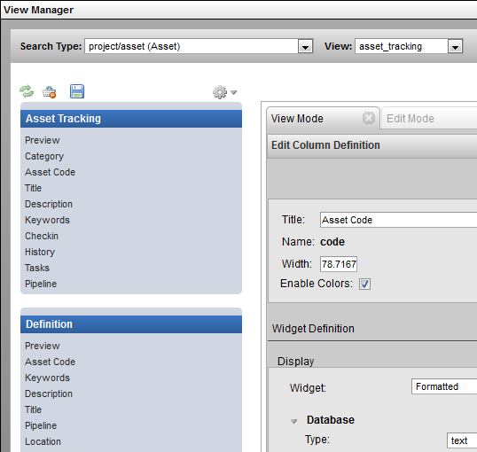
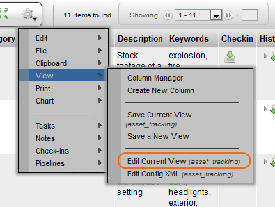
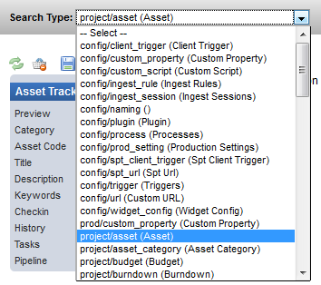
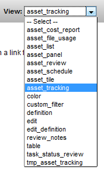
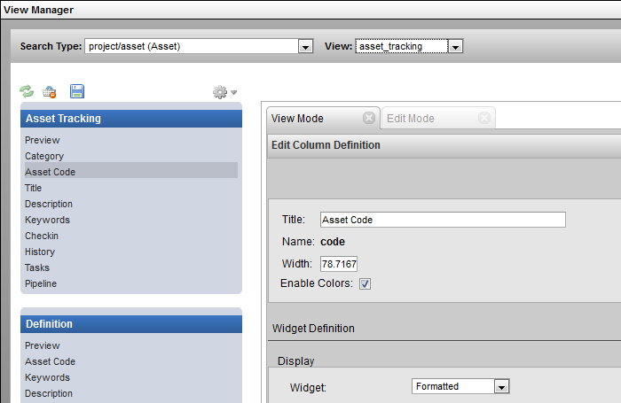
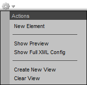
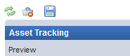

# View Manager

**Description**

The View Manager provides the ability to create, edit and modify views.

This tool can be opened to edit the current view under Gear Menu under:
**View → Edit Current View**

The tool can also be opened and will prompt to select a Search Type and
View to open in the sidebar under: **Admin Views → Project Admin →
Mange Config Views**.

**Implementation**

In the View Manager, select the sType and View if not already selected
for the current view. The drop down selection list provides access to
quickly navigate through all the views available for the selected sType.

<table>
<colgroup>
<col width="50%" />
<col width="50%" />
</colgroup>
<tbody>
<tr class="odd">
<td>

</td>
<td>

</td>
</tr>
</tbody>
</table>

On the side panel on the left, select an element to open the Column
Definition view. The properties for the column are displayed and can be
modified.

The gear menu in the View Manager provides the following options:

-   **New Element** - Create and add a new custom element (column).

-   **Show Preview** - Open a quick preview window of the current view.

-   **Show Full XML Config** - Open an XML view of the current view in a new window.

-   **Create New View** - Create a new view from the UI.

-   **Clear View** - Remove all the elements from the view. *(not definition)*

The **Refresh**, **Trash** and **Save** option buttons located to the left of
the gear menu.

