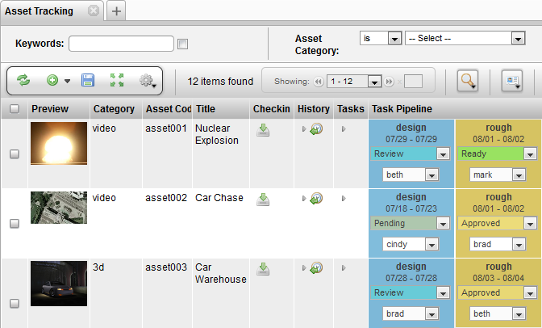

# View Panel

**Description**

The View Panel is a composite widget which binds together a Table Layout
Widget and a Search Widget. The Search Widget is a searching mechanism
that retrieves items and transfers them to a Table Layout Widget to
draw. The View Panel Widget is used in most of TACTIC’s predefined
views.

**Info**

<table>
<colgroup>
<col width="28%" />
<col width="71%" />
</colgroup>
<tbody>
<tr class="odd">
<td>
<strong>Name</strong>
</td>
<td>
View Panel
</td>
</tr>
<tr class="even">
<td>
<strong>Class</strong>
</td>
<td>
ViewPanelWdg
</td>
</tr>
<tr class="odd">
<td>
<strong>TACTIC Version Support</strong>
</td>
<td>
2.5.0 

</td>
</tr>
<tr class="even">
<td>
<strong>Required database columns</strong>
</td>
<td>
none
</td>
</tr>
</tbody>
</table>

**Implementation**

The View Panel widget makes use of the TableLayoutWdg capabilities. The
views available to the View Panel are identical to that of the Table
Layout Widget.

**Options**

<table>
<colgroup>
<col width="31%" />
<col width="68%" />
</colgroup>
<thead>
<tr class="header">
<th><strong>search_type</strong></th>
<th>Define The sType that this View panel displays with.</th>
</tr>
</thead>
<tbody>
<tr class="odd">
<td>
<strong>view</strong>
</td>
<td>
The TACTIC name for the view. e.g. admin.test_asset_tracking
</td>
</tr>
<tr class="even">
<td>
<strong>insert_view</strong>
</td>
<td>
Specify the path to a custom insert view.
</td>
</tr>
<tr class="odd">
<td>
<strong>edit_view</strong>
</td>
<td>
Specify the path to a custom edit view.
</td>
</tr>
<tr class="even">
<td>
<strong>ingest_custom_view</strong>
</td>
<td>
Specify a custom layout view that Ingest Files menu option opens in a new tab.
</td>
</tr>
<tr class="odd">
<td>
<strong>ingest_data_view</strong>
</td>
<td>
Specify a view similar to edit view that defines any data to be saved with each ingested sobject.
</td>
</tr>
<tr class="even">
<td>
<strong>expression</strong>
</td>
<td>
Use an expression for the search. The expression must return items. e.g. @SEARCH(sthpw/note) or @SOBJECT(sthpw/note)
</td>
</tr>
<tr class="odd">
<td>
<strong>filter</strong>
</td>
<td>
JSON data structure representing the settings for SearchWdg
</td>
</tr>
<tr class="even">
<td>
<strong>parent_key</strong>
</td>
<td>
Provide a parent item to filter in the search.
</td>
</tr>
<tr class="odd">
<td>
<strong>search_key</strong>
</td>
<td>
Provide the starting search key.
</td>
</tr>
<tr class="even">
<td>
<strong>search_view</strong>
</td>
<td>
(INTERNAL) View for custom searches.
</td>
</tr>
<tr class="odd">
<td>
<strong>layout</strong>
</td>
<td>
Different layout available - default, tile, fast_table, raw_table, old_table, static_table, collection, browser, card, tool, aggregate, custom_item, custom
</td>
</tr>
<tr class="even">
<td>
<strong>show_gear</strong>
</td>
<td>
Determine whether to show the gear menu - true, false.
</td>
</tr>
<tr class="odd">
<td>
<strong>show_search</strong>
</td>
<td>
Determine whether to show the search box - true, false.
</td>
</tr>
<tr class="even">
<td>
<strong>show_search_limit</strong>
</td>
<td>
Determine whether to show the search limit - true, false.
</td>
</tr>
<tr class="odd">
<td>
<strong>show_insert</strong>
</td>
<td>
Determine whether to show the insert button - true, false.
</td>
</tr>
<tr class="even">
<td>
<strong>show_refresh</strong>
</td>
<td>
Display the refresh button on the shelf - true, false.
</td>
</tr>
<tr class="odd">
<td>
<strong>show_keyword_search</strong>
</td>
<td>
Determine whether to show the Keyword search input - true, false.
</td>
</tr>
<tr class="even">
<td>
<strong>show_select</strong>
</td>
<td>
Determine whether to show row_selection - true, false.
</td>
</tr>
<tr class="odd">
<td>
<strong>show_shelf</strong>
</td>
<td>
Determine whether to show the action shelf - true, false.
</td>
</tr>
<tr class="even">
<td>
<strong>show_layout_switcher</strong>
</td>
<td>
Determine whether to show the layout switcher - true, false.
</td>
</tr>
<tr class="odd">
<td>
<strong>show_column_manager</strong>
</td>
<td>
Determine whether to show the column manager - true, false.
</td>
</tr>
<tr class="even">
<td>
<strong>show_collection_tool</strong>
</td>
<td>
Determine whether to show the collection button - true, false.
</td>
</tr>
<tr class="odd">
<td>
<strong>show_context_menu</strong>
</td>
<td>
Determine whether to show the context menu - true, false.
</td>
</tr>
<tr class="even">
<td>
<strong>show_expand</strong>
</td>
<td>
Determine whether to show the expand button - true, false.
</td>
</tr>
<tr class="odd">
<td>
<strong>show_help</strong>
</td>
<td>
Determine whether to show the help button - true, false.
</td>
</tr>
<tr class="even">
<td>
<strong>show_border</strong>
</td>
<td>
Determine whether to show the table border - true, false.
</td>
</tr>
<tr class="odd">
<td>
<strong>popup</strong>
</td>
<td>
Pop the view up in a pop-up window.
</td>
</tr>
<tr class="even">
<td>
<strong>do_initial_search</strong>
</td>
<td>
Run the search on loading of the view.
</td>
</tr>
<tr class="odd">
<td>
<strong>init_load_num</strong>
</td>
<td>
Set the number of rows to laod initially. If set to -1, it will not load in chunks
</td>
</tr>
<tr class="even">
<td>
<strong>no_results_msg</strong>
</td>
<td>
The message displayed when the search returns no item
</td>
</tr>
<tr class="odd">
<td>
<strong>no_results_mode</strong>
</td>
<td>
The display modes for no results
</td>
</tr>
<tr class="even">
<td>
<strong>custom_filter_view</strong>
</td>
<td>
View for custom filters. Defaults to &quot;custom_filter&quot;.
</td>
</tr>
<tr class="odd">
<td>
<strong>process</strong>
</td>
<td>
The process which is applicable in the UI when load view is used.
</td>
</tr>
<tr class="even">
<td>
<strong>checkin_context</strong>
</td>
<td>
Override the checkin context for Check-in New File - publish (default).
</td>
</tr>
<tr class="odd">
<td>
<strong>checkin_type</strong>
</td>
<td>
Override the checkin type for Check-in New File - auto, strict.
</td>
</tr>
<tr class="even">
<td>
<strong>mode</strong>
</td>
<td>
Mode to pass into the layout engine - widget, raw.
</td>
</tr>
<tr class="odd">
<td>
<strong>element_names</strong>
</td>
<td>
Provide a list of column names (ie. &quot;preview,name,description&quot;) for the view.
</td>
</tr>
<tr class="even">
<td>
<strong>group_elements</strong>
</td>
<td>
Provide a list of grouping column names. e.g. sort_order,category
</td>
</tr>
<tr class="odd">
<td>
<strong>schema_default_view</strong>
</td>
<td>
(INTERNAL) flag to show whether this is generated straight from the schema.
</td>
</tr>
<tr class="even">
<td>
<strong>order_by</strong>
</td>
<td>
The column name to order ascending by. multiple columns are to be comma separated.
</td>
</tr>
<tr class="odd">
<td>
<strong>search_limit</strong>
</td>
<td>
The number of items to show on each page. e.g. 20 A value &lt; 0 means no limit affecting the search.
</td>
</tr>
<tr class="even">
<td>
<strong>search_limit_mode</strong>
</td>
<td>
Determine if it displays top, bottom or both search limit - bottom, top, both
</td>
</tr>
<tr class="odd">
<td>
<strong>simple_search_mode</strong>
</td>
<td>
Display mode of simple search bar - inline, hidden.
</td>
</tr>
<tr class="even">
<td>
<strong>simple_search_view</strong>
</td>
<td>
View for defining a simple search.
</td>
</tr>
<tr class="odd">
<td>
<strong>simple_search_config</strong>
</td>
<td>
Xml config as opposed to a view for defining a simple search.
</td>
</tr>
<tr class="even">
<td>
<strong>simple_search_columns</strong>
</td>
<td>
Number of columns in the simple search bar - 2, 3 or 4.
</td>
</tr>
<tr class="odd">
<td>
<strong>simple_search_visible_rows</strong>
</td>
<td>
Number of visible rows in the simple search bar.
</td>
</tr>
<tr class="even">
<td>
<strong>width</strong>
</td>
<td>
Set the default width of the table
</td>
</tr>
<tr class="odd">
<td>
<strong>gallery_align</strong>
</td>
<td>
Gallery vertical alignment. It is used when a Preview icon is clicked to open in gallery mode - top, bottom.
</td>
</tr>
</tbody>
</table>

**Advanced**

Often, the ViewPanelWdg is defined from a side bar link. It can be
defined by XML as follows

    <element name='summary'>
      <display class='tactic.ui.panel.ViewPanelWdg'>
        <search_type>sthpw/task</search_type>
        <view>task_summary</view>
      </display>
    </element>
