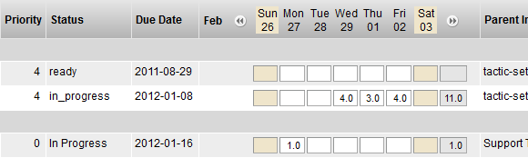
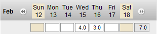

# Work Hours List

**Description**

The Work Hours widget provides an interface to record the number of work
hours spent for each task. The break down of the work hours by task
allows the analysis to be broken down at the lowest level of detail.

**Info**

<table>
<colgroup>
<col width="28%" />
<col width="71%" />
</colgroup>
<tbody>
<tr class="odd">
<td>
<strong>Name</strong>
</td>
<td>
Work Hours List
</td>
</tr>
<tr class="even">
<td>
<strong>Class</strong>
</td>
<td>
tactic.ui.table.WorkHoursElementWdg
</td>
</tr>
<tr class="odd">
<td>
<strong>TACTIC Version Support</strong>
</td>
<td>
2.5.0 

</td>
</tr>
<tr class="even">
<td>
<strong>Required database columns</strong>
</td>
<td>
none
</td>
</tr>
</tbody>
</table>

**Implementation**

The Work Hours List Element is a common column that can be added to any
task view using the Column Manager.

**Options**

There are no options available for this widget.

<table>
<colgroup>
<col width="28%" />
<col width="71%" />
</colgroup>
<tbody>
<tr class="odd">
<td>
<strong>view</strong>
</td>
<td>
The view to retrieve from the Widget Config. This is not required if the HTML option is supplied.
</td>
</tr>
<tr class="even">
<td>
<strong>html</strong>
</td>
<td>
This option is where the HTML code is embedded.
</td>
</tr>
<tr class="odd">
<td>
<strong>search_type</strong>
</td>
<td>
The Search Type the CustomLayoutWdg applies to (if applicable)
</td>
</tr>
</tbody>
</table>

**Examples**

We can record 4 hours of work on Wednesday and 3 hours on Thursday for a
task. The total for that week will also be displayed as a convenience.

