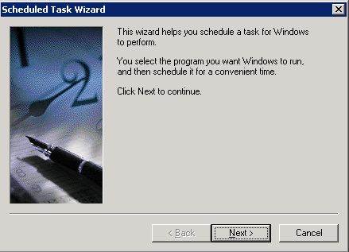
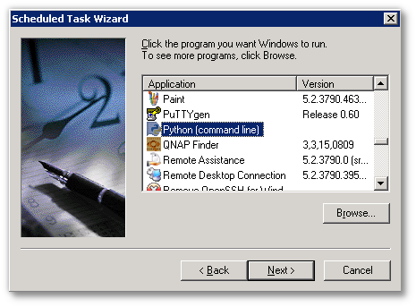
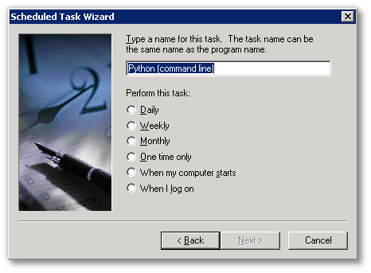
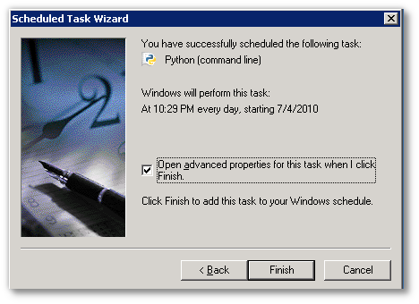

# Database Backup Automation

Overview

The TACTIC database needs backing up as part of a routine maintenance on
the TACTIC system.

Procedure

1.  Log into the TACTIC server as root

2.  Make a backup of the existing /etc/crontab -the original crontab
    should look something like this:

        SHELL=/bin/bash PATH=/sbin:/bin:/usr/sbin:/usr/bin
        MAILTO=root
        HOME=/

        # run-parts
        01 * * * * root run-parts /etc/cron.hourly
        02 4 * * * root run-parts /etc/cron.daily
        22 4 * * 0 root run-parts /etc/cron.weekly
        42 4 1 * * root run-parts /etc/cron.monthly

3.  The following line is an example of code that will write the date
    out to a file and run on the 15th minute of every hour:

    15 \* \* \* \* root date &gt; /root/out

    Modify this example code to run in the next few minutes and add it to
    the crontab. To see if the cron script ran, after the time has passed,
    verify that the script wrote out the time to the file\` /root/out\`. The following line is an example
    of how to backup the TACTIC database every day at 3:45am yum

    45 3 \* \* \* root /usr/bin/pg\_dumpall -U postgres &gt;
    /tmp/my\_tactic\_db\_my\_date

    > **Note**
    >
    > Be careful as this example will overwrite the backup every day . Another
    > more clever way is the name the file with the date:

    45 3 \* \* \* root /usr/bin/pg\_dumpall -U postgres &gt;
    /root/my\_tactic\_db\_\`date +\\%Y-\\%m-\\%0e\_\\%H:\\%m:\\%S\`

    or

    45 3 \* \* \* root my\_date=`date +\%Y-\%m-\%0e_\%H:\%M:\%S`;
    /usr/bin/pg\_dumpall -U postgres &gt; /tmp/my\_tactic\_db\_${my\_date}

    > **Important**
    >
    > \*From crontab manpage:\*The \`\`sixth'' field (the rest of the line)
    > specifies the command to be run. The entire command portion of the line,
    > up to a newline or % char- acter, will be executed by /bin/sh or by the
    > shell specified in the SHELL variable of the cronfile. Percent-signs (%)
    > in the command, unless escaped with backslash (\\), will be changed into
    > newline characters, and all data after the first % will be sent to the
    > command as standard input.

By using Task Scheduler can schedule tasks such as to automate DB backup
to run at a time that is most convenient. Task Scheduler starts each
time Windows is started, and runs as a background process. With Task
Scheduler, you can: Schedule a task to run daily, weekly, monthly.

To add a scheduled task:

1.  Create a windows batch script to back up the database

2.  Click Start→Control Panel→Scheduled Tasks→Add scheduled Task

3.  Create the task.

    

4.  Use the provided python script to dump the database.

    

5.  Run the task according to the schedule required.

    

6.  

7.  At the concluding stage of the scheduled tasks wizard, be sure to
    check the "Open advanced properties for this task when I click Finish"

    

    Edit the command line to read "&lt;path to python&gt;\\python dbbackup.py", and
    click "OK"

