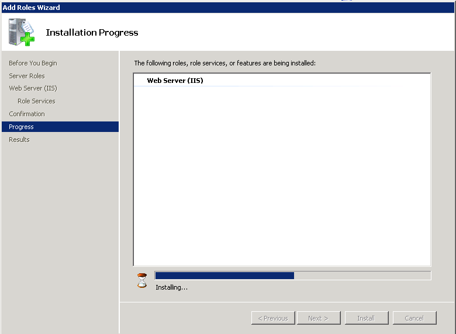
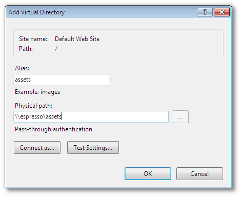
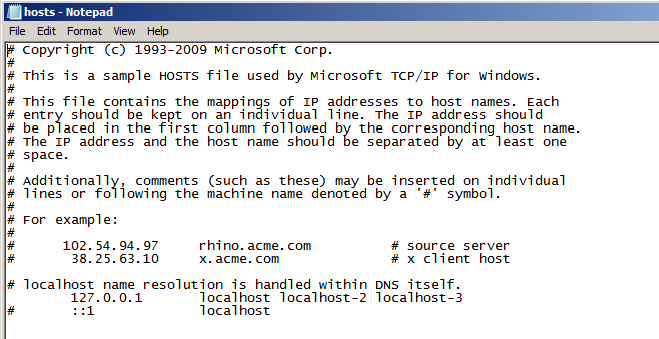
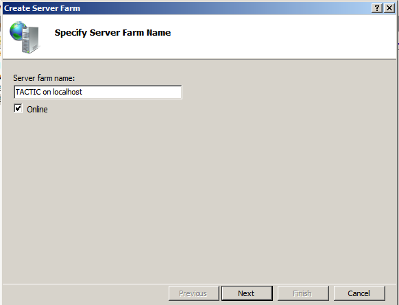
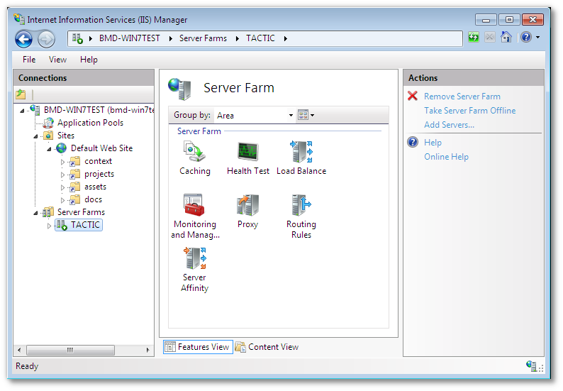
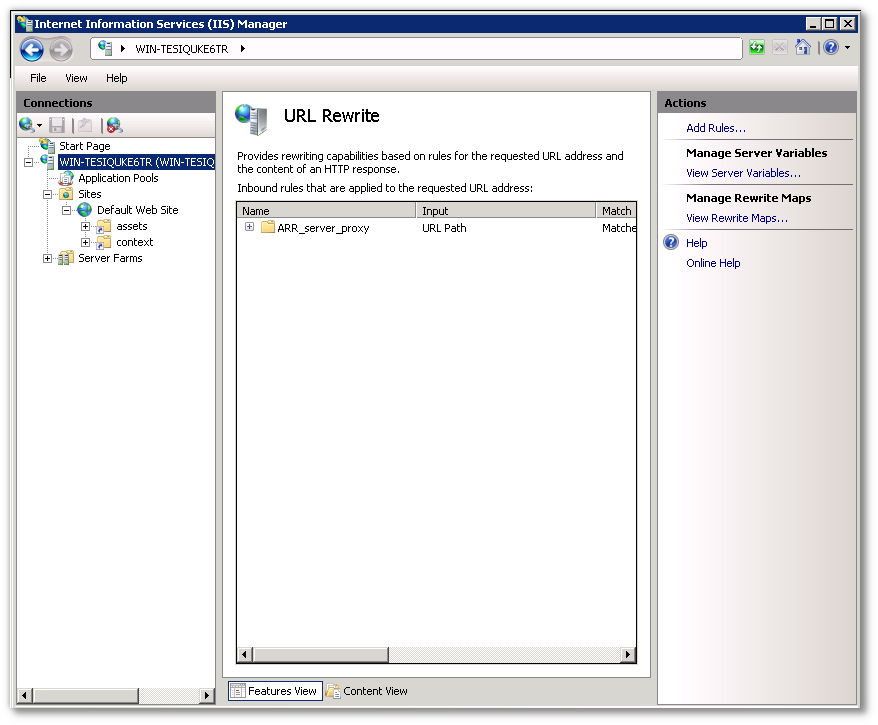

# IIS 7+ HTTP Co-Service Configuration

Windows HTTP co-service installations are IIS based.

On IIS installations prior to version 7, appropriate 3rd party proxying
software (the ISAPI\_Rewrite module) is required to be installed with IIS
to enable the proper functioning of TACTIC.

TACTIC can be configured to work with the native IIS 7.5 services
available on applicable Windows OS’s, such as Windows 7 and Windows
Server 2008. Prior versions of IIS have required 3rd party software (the
ISAPI\_Rewrite module) to be installed alongside the IIS service to
facilitate proxy and URL rewriting. With IIS 7.5, and the introduction
of the ARR and URL rewrite module, the requirement of a 3rd party
software is no longer needed.

On Windows 7, and Windows Server 2008, IIS is installed through means
and directions published on Microsoft support websites. Please consult
installation guides published by Microsoft for the installation
procedure of IIS.

Typically, IIS 7.5 does not come with the ARR module, and depending on
the IIS installation, URL rewrite. These modules are requirements for a
installation alongside TACTIC. Please refer to Microsoft published
documentation regarding installation of these modules.

Permissions must be set for IIS to be able to serve assets that TACTIC
manages.

TACTIC requires that the IIS user have access to TACTIC assets and all
of the virtual directories that contain TACTIC widgets.

Whether the assets directory is stored on the host machine or on a
network mount, there should be a assigned user that runs TACTIC.

For non-domain Windows machines, a local user created on the TACTIC
host, such as the IUSR\_&lt;computer\_name&gt; automatically created by an IIS
installation will suffice, provided that the network mounted directories
are writable by the system user.

For ADS domains, a user can be created on the domain, and assigned via
the Services control panel. Assigning a domain user to the TACTIC
service will allow domain level security rules to apply.

**To assign a user to a service:**

1.  Open the Services control panel

2.  Right click on the "TACTIC application server"

3.  Click on the "Log On" tab

4.  Change the "log on as" option to reflect the user created, whether
    local or domain based.

    

For a locally hosted asset directory , the anonymous user (typically
IUSR\_&lt;computer name&gt;) account needs to be granted access to the
directories, and all subdirectories under them.

Find the directories above in Windows Explorer, and right click on the
directory to bring up “Sharing and Security�? for that directory.

IIS must be configured to serve static content, such as TACTIC assets,
and TACTIC UI skins.

<table>
<caption>Virtual directories required by TACTIC</caption>
<colgroup>
<col width="31%" />
<col width="20%" />
<col width="48%" />
</colgroup>
<thead>
<tr class="header">
<th>Directory Description</th>
<th>Directory Alias</th>
<th>Location</th>
</tr>
</thead>
<tbody>
<tr class="odd">
<td>
Assets storage
</td>
<td>
assets
</td>
<td>
User provided during installation
</td>
</tr>
<tr class="even">
<td>
TACTIC UI widgets
</td>
<td>
context
</td>
<td>
Inside TACTIC installation directory
</td>
</tr>
<tr class="odd">
<td>
Documentation
</td>
<td>
doc
</td>
<td>
Inside TACTIC installation directory
</td>
</tr>
<tr class="even">
<td>
Project storage
</td>
<td>
projects
</td>
<td>
User provided during installation
</td>
</tr>
</tbody>
</table>

There are four “virtual directories�? that must be created to access the
static content provided by TACTIC.

**To create the directories;**

1.  Right click on “Default web site�? and “Add Virtual Directory�?

2.  Create the virtual directory, using the paths that were created by
    the installation of TACTIC. The default paths may not apply.

     3.

> **Important**
>
> If the directory is located on a network mount, it may have to be
> connected to as the user running the TACTIC service. To connect as a
> different user than the IIS user, click on the "Connect As"

+

+
Then click on the "Set…​" button, and fill in the details of the user
that will run the TACTIC service.

+

There should now be 4 virtual entries on the IIS service.

Application Request Routing (ARR) is the module snap-in that will proxy
and load balance requests. ARR is required by IIS to split incoming
TACTIC service requests between the dynamic content that drives the API
and the TACTIC web UI, and static content. In order to achieve this, IIS
must be configured to send certain requests to the TACTIC application
server, while static data requests (usually assets) are sent to IIS.

This guide currently supports two methods of attaching the TACTIC
service to an IIS co-service.

**Proxy/Load balancing**

The Load balancing configuration of IIS splits TACTIC service requests
into multiple streams, with each stream utilizing its own TACTIC service
process.

**Proxy Only**

The proxy-only configuration routes all TACTIC service requests to a
single TACTIC service. This method should only be used in light usage
TACTIC installations such as development servers.

A TACTIC installation by default runs 3 seperate TACTIC service
listeners, arranged on default ports 8081, 8082 and 8083. To split
TACTIC service requests into multiple streams, IIS must be configured to
consider TACTIC part of a “server farm�?. Since all of the TACTIC
services are running on one single host, IIS currently must be tricked
into routing requests to the 3 different TACTIC streams on the
localhost.

By default, windows looks in the hosts file, then to DNS for named
hosts. To divide localhost into three “different�? machines, the
`“%SYSTEMROOT%/System32/drivers/etc/host�?` file must be edited to be
able to address localhost as more than one machine.

> **Important**
>
> If TACTIC is set to run a number of processes other than the default of
> three, then these instructions must reflect that number. Add or subtract
> from the list of localhost entries and web farm entries accordingly.

**To create a web farm**;

1.  As an “Administrator�? user, edit the “127.0.0.1�? line in this file

    

    The addition of localhost-2 and localhost-3 that reference 127.0.0.1
    allow this host machine to access localhost as more than one machine.

2.  Now the Server Farm reference must be created.

    Start the IIS snap in, and select the Web server that will be used as a
    TACTIC co-service in the left side navigation bar. Right click on the
    “Server Farms�? folder and create a new server farm.

    

    3 seperate servers must be added to the server farm to correspond to the
    3 default TACTIC service processes. Add each server according to the
    below table.

    <table>
    <colgroup>
    <col width="50%" />
    <col width="50%" />
    </colgroup>
    <thead>
    <tr class="header">
    <th>Server Address</th>
    <th>httpPort</th>
    </tr>
    </thead>
    <tbody>
    <tr class="odd">
    <td>
localhost-1
</td>
    <td>
8081
</td>
    </tr>
    <tr class="even">
    <td>
localhost-2
</td>
    <td>
8082
</td>
    </tr>
    <tr class="odd">
    <td>
localhost-3
</td>
    <td>
8083
</td>
    </tr>
    </tbody>
    </table>

    Click on “Add�? when done each entry in the above list. For additional
    servers, the “server address�? must correspond to the additional
    localhost entries in the “hosts�? file. The ports must correspond to
    8082, 8083, etc. Add the required number of servers according to TACTIC
    deployment requirements.

    

3.  Click “Finish�? when done.

4.  Create the rewrite rule when prompted.

URL rewrite must now be configured to only send TACTIC API requests to
the server farm.

1.  Click on the server farm icon on the left-hand side of IIS manager
    and click the “Routing Rules�? icon.

    

2.  In the right pane of the Routing rules section, click the "URL
    rewrite" link

    

3.  Select the automatically created URL rewrite rule created when the
    web farm was created, and click on the "Edit" link in the right pane.

    

    In the “Edit Inbound rule�? pane, edit the pattern to read
    “tactic\*,projects\*�? This will instruct IIS to route all TACTIC UI
    requests to the TACTIC service.

    

4.  Apply the change.

ARR comes with several load balancing algorithms. Click on the newly
created server farm, and click on the “Load Balancing�? icon. Select
“Weighted round robin�? as the algorithm, and “Even distribution�? as
the load distribution.

IIS can be configured to run a single rewrite rule to forward requests
to a single TACTIC service.

Start the IIS snap in, and select the Web server that will be used as a
TACTIC co-service in the left side navigation bar. Choose “Application
request routing�? And click on server proxy settings on the right-hand
side.

In the ARR options under the proxy settings check the “use URL rewrite
to inspect incoming requests�?, And in the “reverse proxy�? text area
type “localhost:8081�?. This instructs IIS to proxy everything to this
address and port.

From here URL Rewrite can then be instructed to filter proxy requests.
Click on the “URL rewrite�? link on the right-hand side to modify
rewrite rules. Typically, if the proxy has been created in ARR, then a
rule will be created in URL rewrite.

IIS must then be instructed to only proxy TACTIC UI and API requests. To
do this, an automatically created rule must be altered to allow TACTIC
asset requests to be handled by IIS.

To modify the existing rule for TACTIC, the pattern under "Match URL"
should be "tactic\*". The action “Rewrite URL�? should be
"http://localhost:8081/\\{R:0}"

TACTIC currently has a requirement to insert custom MIME types into the
list of allowed types for the IIS service.

<table>
<colgroup>
<col width="33%" />
<col width="33%" />
<col width="33%" />
</colgroup>
<thead>
<tr class="header">
<th>MIME type</th>
<th>Function</th>
<th>Extension</th>
</tr>
</thead>
<tbody>
<tr class="odd">
<td>
text/plain
</td>
<td>
Python Script mask
</td>
<td>
.xx
</td>
</tr>
</tbody>
</table>

To add a MIME type in IIS 7

1.  Click on the web server entry in the left-hand pane.

2.  Click on the MIME types icon in
    the centre pane.

3.  Click on the "Add…​" link on the right-hand pane.

4.  Add all entries required by the table above.

    

At this point IIS should be configured to proxy TACTIC service requests
to the TACTIC service, while leaving all other requests to IIS.

<http://learn.iis.net/page.aspx/485/define-and-configure-an-application-request-routing-server-farm/>

<http://learn.iis.net/page.aspx/486/http-load-balancing-using-application-request-routing/>

<http://blogs.msdn.com/nickhodge/default.aspx?p=2>
