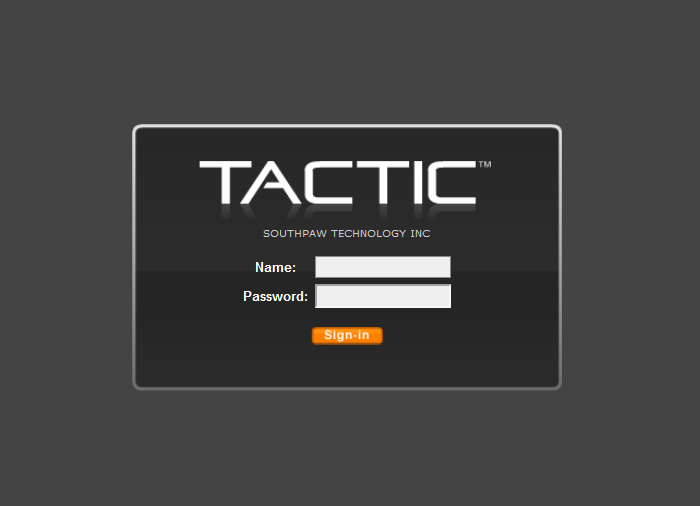

# General TACTIC Install

This document guides you through the general installation of TACTIC on any server environment with some brief background information. For installation on Windows or RHEL environment, please refer to the corresponding sections in this book. 

To completely install TACTIC, there are five main components that
have to be set up in the following order:

1. Database

2. Python 

3. Image Utilities

4. TACTIC Installer

5. A Web Server


## Install Database

TACTIC stores all metadata in a database, and supports a variety of database types.
The recommended database is PostgreSQL - an industrial strength, hugely scalable database that has proven itself in thousands of industries around the world. 
We currently recommend 9.6 and upwards for ease of installation. 
Go to the <a href="http://www.postgresql.org" target="_blank">PostgreSQL website</a> for more information.

1.  yum install postgresql postgresql-server postgresql-contrib
    postgresql-devel

2.  Edit the file */var/lib/pgsql/data/pg_hba.conf*. This file determines all of the
    user permissions for PostgreSQL. To begin with, turn on all of the
    permissions contained in this file. This is a temporary measure that
    will greatly simplify the installation process. You may lock down these
    permissions at a later date. Please consult the PostgreSQL documentation
    on how to do this. TACTIC ships with a sample "pg_hba.conf" file
    (located in $TACTIC_unzipped_package/src/install/postgresql/pg_hba.conf). This file has an open
    security setting for ease of installation. It’s best to back up your
    current pg\_hba.conf file before copying over with the file provided by TACTIC.

3.  Restart the PostgreSQL Service

**Verification**

Verify that psql works in the command prompt:

```
> psql -U postgres template1
```

It should give you a prompt:

```
template1=#
```

If you see this prompt without the need to enter a password, you have
successfully installed the PostgreSQL database. Type \\q to exit.

## Install Python

Python is a core element of the TACTIC application, along with supporting Python modules

First, you must install Python 2 or 3. Installers are available from the <a href="https://www.python.org"/>Python website</a>.
Python 2 has reached EOL as of January 2020, and it is recommended to start new installations with Python 3.
Python 2.7 and 3.7+ are recommended versions for TACTIC. 

Second, you must install supporting modules. These modules depend on your version of Python, and your server environment.
You must install the version of each module that matches your Python version.

*Python 2 Linux modules*

- pillow
- lxml
- pycryptodomex


*Python 3 Linux modules*

- pillow
- lxml
- pycryptodomex
- jaraco.functools
- pytz


*Python 2 Windows modules*

- pillow
- lxml
- pycryptodomex
- pywin32

*Python 3 Windows modules*

- pillow
- lxml
- pycryptodomex
- jaraco.windows
- pytz
- pywin32


You will also need a Python DB connectivity module. For PostgreSQL, use psycopg2 and for MySQL use MySQLdb.

On Windows systems, TACTIC Python and supporting module availability is
through the websites of the supporting module projects. 

On UNIX/Linux systems, the system package manager typically has options
for installing all the required Python packages onto the UNIX host
machine. 


## Install Image Utilities

<a href="https://imagemagick.org/">Imagemagick</a> and <a href="https://www.ffmpeg.org/">ffmpeg</a> are by TACTIC for various asset functions such as icon generation and metadata extraction. Installers are available for both Linux and Windows systems.


## Install TACTIC

Unzip the file in a temporary location.

```
# cd /tmp
# unzip tactic_#.#.#.#.zip
```

Go to
/tmp/tactic\_\#.*.*/src/install/

```
cd /tmp/tactic_#.#.#.#/src/install
```

Execute: 
install.py

> **Note**
>
> You must invoke the installation with root user privileges because it
> attempts to write to the &lt;python\_install&gt;/site-packages directory.

```
su
python install.py
```

The installer will ask a number of questions. First it ask for the
&lt;TACTIC\_BASE\_DIR&gt;:

    Please enter the base path of the TACTIC installation:

    (/home/apache) ->

Enter the user the Apache Web Server is run under.

    Please enter the user Apache Web Server is run under:

    (apache) ->

It would copy the source code to the base path and create a symbolic
link to it. An Apache Web Server file will be generated at the end which
you would need to copy to the Apache config area upon installation of
the web server. If there are existing files in the destination directory
the installer will ask for your confirmation to remove it. At the end,
you will see this:

    *** Installation of TACTIC completed at [/home/apache] ***


    Next, please install the Apache Web Server and then copy the Apache config extension
    [/home/apache/tactic_data/config/tactic.conf] to the Apache web server config area. e.g.
    /etc/httpd/conf.d/

**Verification**

When the installation is completed, an asset directory will be created
at '&lt;TACTIC\_DATA\_DIR&gt;/assets'.

The file tactic\_paths.py will be created in the following directories:

**Linux**

    /usr/lib/python#.#/site-packages/tacticenv

Default contents:

    TACTIC_INSTALL_DIR='/home/apache/tactic'
    TACTIC_SITE_DIR=''
    TACTIC_DATA_DIR='/home/apache/tactic_data'


## Network Machine Access

If you are on the server, you can access it by using the URL
<http://localhost/tactic>. For other people to access it on the network,
you need to find out its IP address. In a linux server, you can use the
command "ifconfig" to locate it. It’s the one listed as the inet addr.


## Install Webserver

TACTIC should be run behind an Apache web server. You can download
Apache software at <http://www.apache.org/>

The TACTIC application server is able to serve up static content such as
images, PDF files, Quicktime files, and so on, but it is not the most
efficient at this because it is written in Python. This is what Apache
is designed for. By running TACTIC behind Apache, it relieves TACTIC
from serving the static content so that it can focus on the dynamic
content.

For production use, it is highly recommended that TACTIC is run behind
the Apache server. This has many scalability advantages. When running
behind Apache, Apache uses a reverse proxy and proxy balancer module to
forward requests to communicate with TACTIC.

**Linux**

After the installation, some changes may need to be made in the
"httpd.conf" file for Apache.

    Fedora Core: /etc/httpd/conf/httpd.conf

Make sure the following lines are uncommented:

    LoadModule rewrite_module modules/mod_rewrite.so
    LoadModule proxy_module modules/mod_proxy.so
    LoadModule proxy_http_module modules/mod_proxy_http.so
    LoadModule proxy_balancer_module modules/mod_proxy_balancer.so
    LoadModule deflate_module modules/mod_deflate.so

Additional lines For Apache 2.4:

    LoadModule slotmem_shm_module modules/mod_slotmem_shm.so
    LoadModule filter_module modules/mod_filter.so
    LoadModule lbmethod_byrequests_module modules/mod_lbmethod_byrequests.so

These lines may already be uncommented, depending on your distribution
and version of Apache. You need Apache version 2.0.31 or later.

The TACTIC installer generates an Apache extension conf file on
completion. Copy that file to a directory that is recognized by Apache.

For Fedora Core: copy the TACTIC generate Apache conf extension file to
the following directory:

    /etc/httpd/conf.d/

If there is no such configuration extension folder, you must add the
following line to the "httpd.conf" file so that it will read the
extension configuration file provided by the installer:

    Include conf/tactic_win32.conf

**Web Server configuration**

In our provided file:

    tactic.conf

Make sure the following lines exist:

    # Using the ProxyPass directives
    ProxyPreserveHost on

    <Proxy balancer://tactic>
    BalancerMember http://localhost:8081/tactic
    BalancerMember http://localhost:8082/tactic
    BalancerMember http://localhost:8083/tactic
    </Proxy>
    ProxyPass /tactic balancer://tactic
    ProxyPass /tactic_data balancer://tactic

For Apache 2.4:

Comment out:

    #Order Allow,Deny
    #Allow from All

Uncomment:
    
    Require all granted

> **Note**
>
> Warning: For load balancing, only use either:
>
> 1.  the Proxy Balancer method (recommended)
>
>         or
>
> 2.  the RewriteRule method (not recommended).
>
> Do **not** use both methods at the same time.

> **Note**
>
> For configuring load-balancing set-up in a real production, please refer
> to the Load Balancing section in the Sys-admin docs.

> **Note**
>
> When trying to set up Apache on a Windows Server, to specify a share
> folder for Apache to use, you may need to include the name of the share
> folder in the path.
>
> For example, use the following if you have named the share folder
> "my\_share":
>
>     Alias /assets "//10.0.0.17/my_share/assets"

Finally, after verifying the configuration is correct, restart the
Apache service:

    service httpd restart

## Verify the Installation

Go to the "&lt;TACTIC\_INSTALL\_DIR&gt;/src/bin" folder

Then su as the user tactic and run startup\_dev.py:

    cd /home/apache/tactic/src/bin

    su tactic

    python startup_dev.py

This "startup\_dev.py" script is the development script which will dump
output to the screen. The other startup script "startup.py" is the
production start-up script and will dump output to a log file. The
development start-up script is also much slower as it monitors the file
system to see if any files have changed.

The output would look like the following:

    Registering site ... admin
    Registering site ... default
    Registering site ... test
    Registering site ... my_project

    Starting TACTIC ...

    05/Jul/2007:11:16:29 CONFIG INFO Server parameters:
    05/Jul/2007:11:16:29 CONFIG INFO server.environment: development
    05/Jul/2007:11:16:29 CONFIG INFO server.log_to_screen: True
    05/Jul/2007:11:16:29 CONFIG INFO server.log_file: D:/tactic_temp/log/tactic_log
    05/Jul/2007:11:16:29 CONFIG INFO server.log_tracebacks: True
    05/Jul/2007:11:16:29 CONFIG INFO server.log_request_headers: True
    05/Jul/2007:11:16:29 CONFIG INFO server.protocol_version: HTTP/1.0
    05/Jul/2007:11:16:29 CONFIG INFO server.socket_host:
    05/Jul/2007:11:16:29 CONFIG INFO server.socket_port: 8081
    05/Jul/2007:11:16:29 CONFIG INFO server.socket_file:
    05/Jul/2007:11:16:29 CONFIG INFO server.reverse_dns: False
    05/Jul/2007:11:16:29 CONFIG INFO server.socket_queue_size: 10
    05/Jul/2007:11:16:29 CONFIG INFO server.thread_pool: 5
    05/Jul/2007:11:16:30 HTTP INFO Serving HTTP on http://localhost:8081/

`http://<TACTIC_server_address>/tactic/admin/`

You should see the TACTIC login appear.



There is a default user created on installation. This is the "admin"
user and this user has the ability to see and change all aspects of the
system. Log in as the admin user:

> **Note**
>
> You may be asked to change your password automatically at startup
>
> without entering these default credentials.
>
> <table>
> <colgroup>
> <col width="50%" />
> <col width="50%" />
> </colgroup>
> <tbody>
> <tr class="odd">
> <td><p><strong>user:</strong></p></td>
> <td><p><code>admin</code></p></td>
> </tr>
> <tr class="even">
> <td><p><strong>password:</strong></p></td>
> <td><p><code>tactic</code></p></td>
> </tr>
> </tbody>
> </table>
>
> **Note**
>
> If you have not set up the TACTIC service, refer to the page
> "Configure the TACTIC Service".

First, stop TACTIC running in dev mode if applicable by pressing Ctrl ^ C in that shell

In Linux:

    service tactic start

At this point you will need to install a TACTIC license file and then
begin to set up a project.

For more information on installing the license file, please refer to the Install License File chapter.

For more information on getting started with projects, please refer to Setup documentation.
