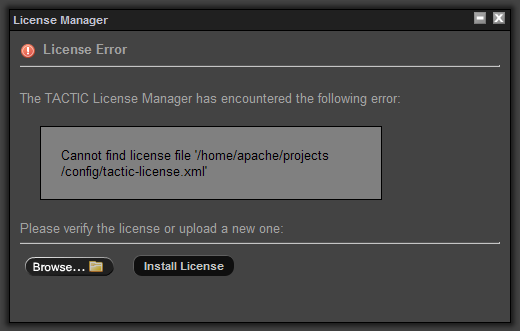
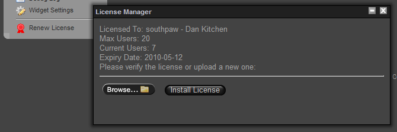

# Install a TACTIC License

## Install License

When TACTIC is accessed through the web browser, if a license file
cannot be found, TACTIC will prompted for a license file.

To install a license file, browse for the license file (.xml) provided
by Southpaw Technology. Once the file has been selected for upload,
click **Install License** to upload and install the license file.

If the license file is valid, TACTIC will display the message "License
renewal completed"

Once this has been completed, TACTIC will no longer prompt for a valid
license file.

## Renew License

To view information on the total users for the license and how many are
active and to update the existing license file, in the sidebar, load
**Global → License** From here you view the License statistics
and update a new license file.

## Manual License Install

When the user interface tool is used to upload the license, TACTIC
renames the file to tactic-license.xml and places it on the server under

    <TACTIC_DATA_DIR>/config/tactic-license.xml

The XML file provided from the TACTIC representative can be renamed.
After the rename, place the license on the server according to the
structure outlined above and re-browse to tell TACTIC the new license
name.
