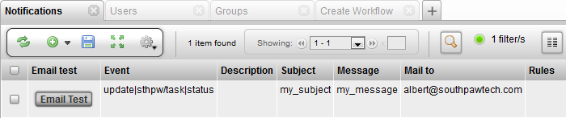

# Setup Email

This document describes how to setup the mail server settings in TACTIC
in order for notifications to be sent out as emails.

To setup the SMTP mail server, open the TACTIC config file.

The TACTIC config file is located here:

On Linux:

    <TACTIC_INSTALL_DIR>/projects/config/tactic_linux-conf.xml

On Windows:

    <TACTIC_INSTALL_DIR>/projects/config/tactic_win32-conf.xml

Go to the **&lt;services&gt;** section of the config file.

Add the following settings with the prefix **&lt;mail…​&gt;**.

Below is an example of a completed mail config section in **bold**:

        <python>python</python>
        <python_path></python_path>
        <render_submit_class></render_submit_class>
        <render_dispatcher></render_dispatcher>
        <system_class></system_class>
        <pool_max_connections>3</pool_max_connections>
        <process_count>3</process_count>

<table>
<colgroup>
<col width="50%" />
<col width="50%" />
</colgroup>
<thead>
<tr class="header">
<th><code>mailserver</code></th>
<th>The URL of the SMTP mail server</th>
</tr>
</thead>
<tbody>
<tr class="odd">
<td>
<code>mail_password</code>
</td>
<td>
The password for accessing the SMTP mail server that requires authentication
</td>
</tr>
<tr class="even">
<td>
<code>mail_user</code>
</td>
<td>
The user name for accessing the SMTP mail server that requires authentication
</td>
</tr>
<tr class="odd">
<td>
<code>mail_port</code>
</td>
<td>
The port for the SMTP mail server (if different that 25)
</td>
</tr>
<tr class="even">
<td>
<code>mail_sender_disabled</code>
</td>
<td>
disable using the sender name in sending of email in case the email server does not allow sender’s email not owned by the sender
</td>
</tr>
<tr class="odd">
<td>
<code>mail_tls_enabled</code>
</td>
<td>
enable TLS (Transport Layer Security) for the connection to email server
</td>
</tr>
</tbody>
</table>

Go to the Notifications view under:

**Admin Views → Site Admin → Notifications**

Click on the green plus button on the tool shelf to insert new a
notification.

Fill in the following the minimum fields to create a test notification:

Click on the **Email Test** button to send out a test email to the
recipient.

For further details on setting up advanced notifications, please refer
to the doc titled: **Advanced Notification Setup**.
