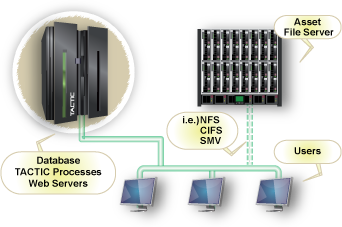
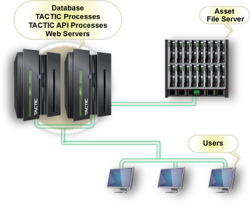
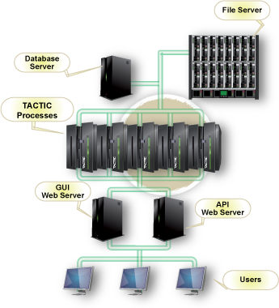
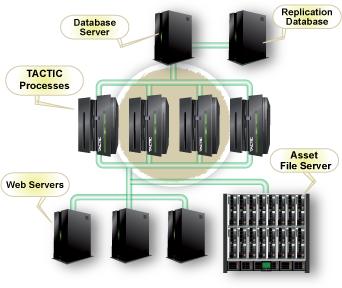
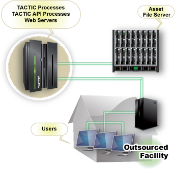

# TACTIC System Requirements

## Client Computer Requirements

**Supported Operating Systems**

-   Windows

-   MAC OS

-   Linux

-   Smartphones

-   Tablets

Note - The main criteria in the majority of cases for TACTIC access is the web browser. TACTIC is a cross platform solution.

**Supported Browsers**

-   Chrome (Officially Supported)

-   Safari (Compatible)

-   Mozilla Firefox 33.0+ (Compatible)

-   Internet Explorer 11.0+ (compatible for everyday usage - HTML5 support is limited on IE)

Note - Other web browsers may work but are not certified for TACTIC.

**Required Browser Plugins**

We have moved away from needing the Java plugin in our latest release, and instead, have moved on to using HTML5 in its place. This was done to remove external dependencies and create a better user experience. However, depending on the version of TACTIC that you use, the Java plugin may be used in many cases to communicate with the client computer’s operating system. This plugin is used primarily in application integration to pass files through the client web browser to and from the TACTIC server. To download the latest version of the Java plugin, go to <http://www.java.com>

## Server Requirements 

**Typical TACTIC Server Configurations**

- Small Shop: Less than 10 Users Medium Content Creation: 10 - 50 Users 
- Large Scale Content Creation: 50 - 150 
- Users Enterprise Business: More than 150 users 
- High Availability: High service availability (99.9% Up-time guarantee) 
- Remote Collaboration: Live World Wide Production

**Small Shop (< 10 Users)**

A small cloud business might need to track lists of information, tasks, notes and general production data. Simple files can also be tracked. TACTIC Server recommendations:

-   Single computer configuration with all the services installed on the same machine.

-   Online cloud service or in-house installation

-   CPU - Dual Core processor

-   RAM - At least 600MB ram

-   HDD - 10GB (+ asset storage requirements)

-   3 TACTIC Process for load balancing

**Medium Content Creation (&lt; 50 Users)**

Dual server computer configuration with TACTIC. Database and web server on one computer and a separate fileserver. Examples include content creation departments, visual effects studios, media management solutions.

TACTIC Server

-   CPU - Dual or Quad core processor

-   RAM - 4-8GB ram

-   HDD - 10GB

-   8 TACTIC Process for load balancing

- File Server SAN or Fileserver with adequate storage based on project requirements. Note that TACTIC generates a more efficient file system so space is used more efficiently.

**Large Scale Content Creation (&lt; 150 Users)**

Represented by companies who have a 100+ team producing and managing complex assets and production data. Examples include large content creation departments, feature film and episodic CG production.

TACTIC Server

-   1-2 Servers CPU - Quad core processor  

-   RAM - 8GB+ ram

-   HDD - 10GB

-   3 TACTIC Process for load balancing

- File Server SAN or Fileserver with adequate storage based on project requirements. Note that TACTIC generates a more efficient file system so space is used more efficiently.

**Enterprise Business (150+ Users)**

In large scale enterprise scenarios, the scalability features in TACTIC are heavily used to accommodate the high bandwidth demands of enterprise business.

TACTIC Server

-   Multiple Servers

-   CPU - Quad core processor  

-   RAM - 8GB+ ram

-   HDD - 10GB

-   10+ TACTIC Process for load balancing on each server

- File Server SAN or File server with adequate storage based on project requirements. Note that TACTIC generates a more efficient file-system so space is used more efficiently. w

- Single database server allowing for multiple physical TACTIC servers.

**High Availability - Up-time Guarantee**

In almost any size business, there may be a requirement for TACTIC to be a high availability service. The main aspect of

configuring TACTIC with this approach is providing redundant services at all levels. TACTIC Server 2+ Physical TACTIC servers with redundant power, HDD etc.

-   CPU - Quad core processor  

-   RAM - 8GB+ ram

-   HDD - 10GB

-   8+ TACTIC Process for load balancing per server

- File Server SAN or File server with adequate storage based on project requirements. Redundant data retention for file system up-time. 

- Database Server 2+ database servers setup with replication for database up-time. Return to section top

**Remote Collaboration (World wide production)**

TACTIC is a web based enterprise application which can be scaled out to provide seamless collaboration between physical locations using common database and file system technology and practices.

TACTIC Server

-   Master Physical TACTIC server

-   CPU - Quad core processor  

-   RAM - 4GB+ ram

-   HDD - 10GB

-   8+ TACTIC Process for load balancing per server

-   Remote collaboration server(s)

-   CPU - Quad core processor  

-   RAM - 4GB+ ram

-   HDD - 10GB

-   3+ TACTIC Process for load balancing

File Server

-   Master file server

-   Base central file server

-   Remote File Server(s)

-   Synchronized through common protocols or through specific processes/triggers in TACTIC

## TACTIC Server Installation Requirements

**Supported Operating Systems**

-   Fedora 12+

-   CentOS 5.5+

-   Windows Server 2008 or later

TACTIC has been set-up on a wide variety of operating systems. Our documentation provides detailed instructions on the above, however, it is left to the user to install on others.

**API**

-   Python 2.7+

-   Javascript (Client side Interaction)

**Web Servers**

-   HTTP

-   Apache 2.2+

-   IIS 7+

**Database**

-   TACTIC Database Configuration

## Installation Process Requirements

What sort of access do you need to complete a full TACTIC installation and implementation?

-   A physical of virtual server dedicated to TACTIC

-   Root Access to the server

-   Knowledge of the current network infrastructure

-   Ability to install Modules etc

-   Knowledge of Python is a plus

