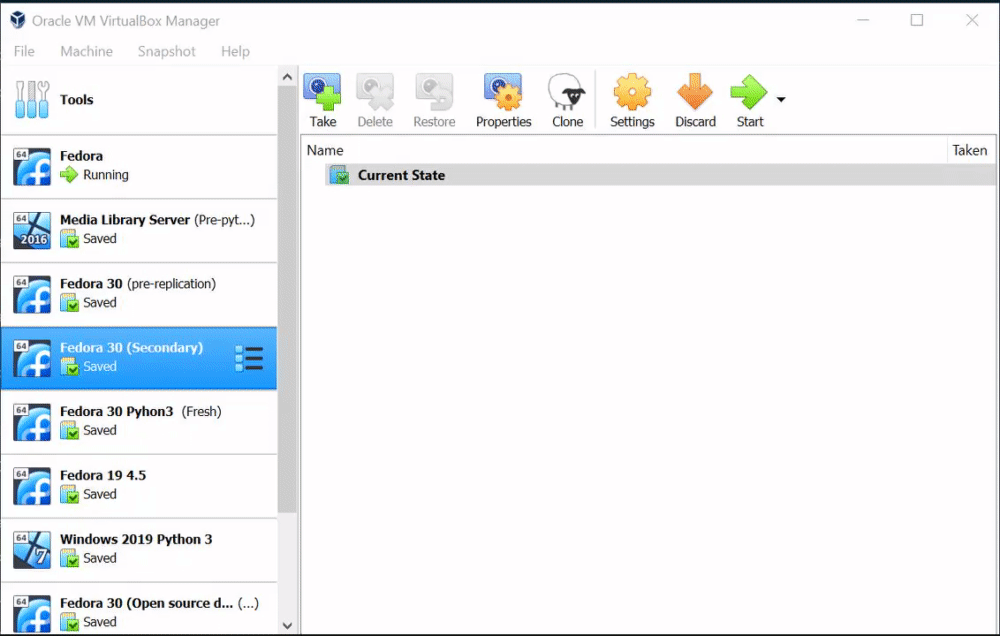
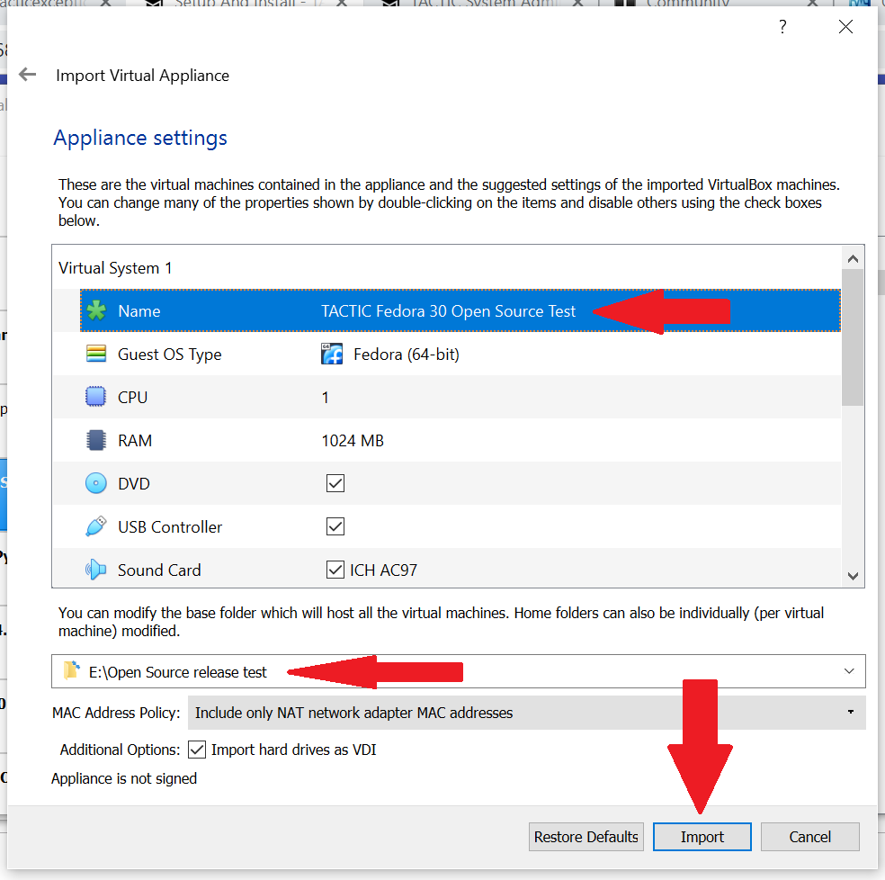
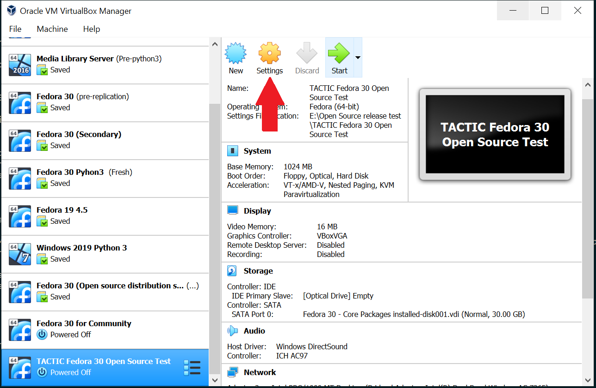
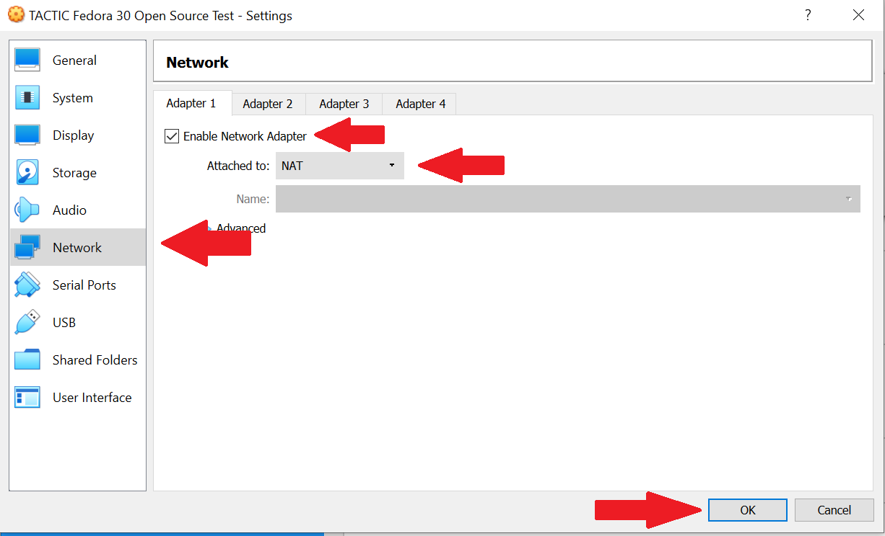
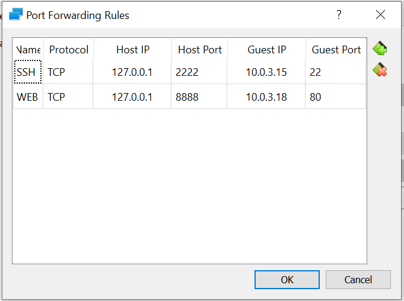
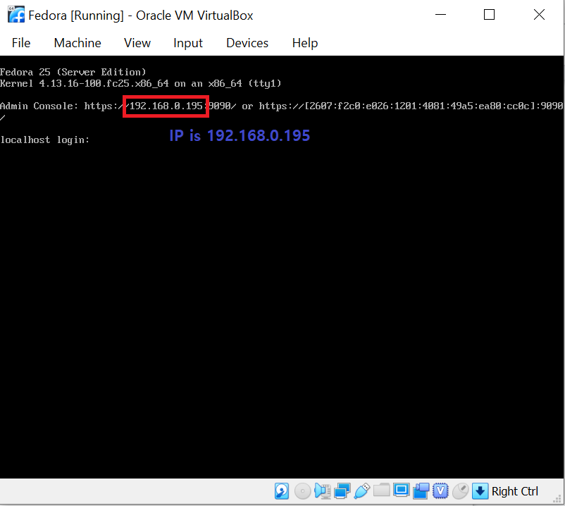
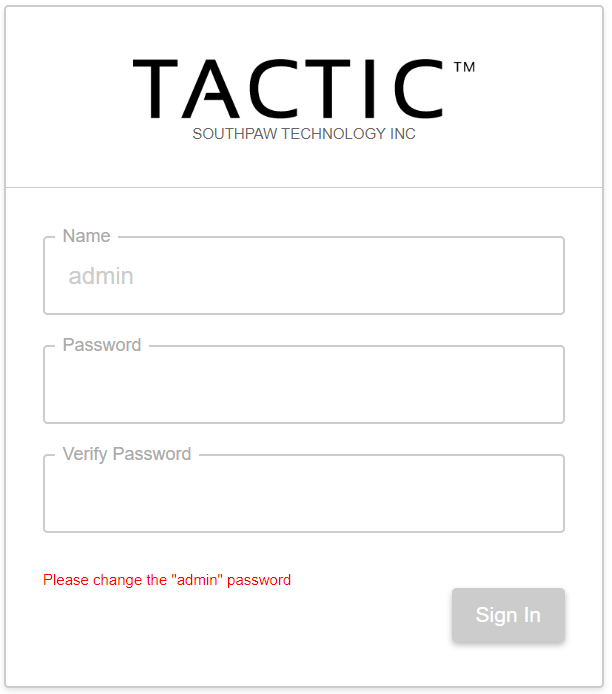

# TACTIC VM Setup and Install

The TACTIC VM is an evaluation of a TACTIC server environment on your own computer. The TACTIC VM is not intended for a production setting, and requires further configuration for large scale production use. See the Server Configuration section of the System Administrator documentation for configuration details.  

This document provides installation details using VirtualBox, however any virtual machine manager (ie. VMWare player) can be used.

Download the VM from the community site <a href="http://community.southpawtech.com/tactic/community/link/downloads">downloads page</a>.

## VirtualBox Setup

1. [Download](https://www.virtualbox.org/) and install VirtualBox.

2. Import the TACTIC VM into VirtualBox using File > Import Virtual Appliance

    

3. Click Next, and review the VM information. Provide a name and storage location for your VM, then click Import.

    

4. Configure Networking

    Select the newly imported VM from the list in the left sidebar, and click Settings. 

    

    Open Network, and choose the network interfaces you want enabled.

    

    A network interface is necessary to access the application through browser.
    You can choose one or more of the following suggested interface settings below:
    
    - **NAT**

        - If it becomes necessary to isolate the VM on a host machine, then the NAT interface can be used to connect to the VM.
        - Enable Advanced > Port Forwarding with the following configuration:
    
            

        - Internet and LAN connectivity can be utilized through the NAT
            interface if the host machine is connected to an external network such
            as the internet or a LAN. Allowing the VM to communicate with a LAN may
            require changes to the routing system on the LAN. If this is a
            requirement, then bridged networking may be the better option.

        - NAT is a complete network that originates at the host machine, and is
            a self-contained router with DHCP services. The VM, once run, will
            usually ask the host machine for an IP address to assign to a network interface. The host machine can then connect to the VM interface through
            this IP.

    - **Bridged Adapter**

        -   If there are machines other than the host machine that are required
            to connect to the VM, then the bridged connection should be used.

        -   The only requirement that bridged networking has is that there are
            appropriate services for the operation of the interface, such as DHCP on
            the host machines network. If these services do not exist, then the VM
            network interface needs to have manually set options.

    - **Host-Only Adapter**

        -   To isolate the TSI completely, this option can be used.

        -   Host Only is a complete network that originates at the host machine,
            and is a self-contained router with DHCP services. The VM, once run,
            will usually ask the host machine for an IP address to assign to a
            network interface. The host machine can then connect to the VM interface
            through this IP.

        -   The VM is completely isolated from the host machines LAN. There is no
            network connectivity, therefore no LAN or internet will be available on
            the VM.

    > **Note** Successful operation of a virtual machine may require some input from system administrators within a network environment.

5. Start the VM using Start 
    
    

6. Retrieve your IP address to access the TACTIC application. If you use an NAT adapter, you can access TACTIC in browser using,

    `localhost:8888`

    If you used a Bridged or Host-Only adapter, the IP will appear on the VirtualBox interface,
    
    

7. Access TACTIC at your IP in browser. The server should return the TACTIC Login page,
    
    

8. Continue your TACTIC exploration using the [Quick Start documentation](http://community.southpawtech.com/docs/quick-start).

## Login Info

There are two sets of login info to remember:

1.  VM Linux user

    - user: root 
    - password: south123paw

2.  Samba share

    - user: tactic 
    - password: south123paw

To make your evaluation easier, the TSI uses passwords that are easy to
guess and a Samba share. This could cause security issues, so your IT
department must be aware of your use of the TSI.

