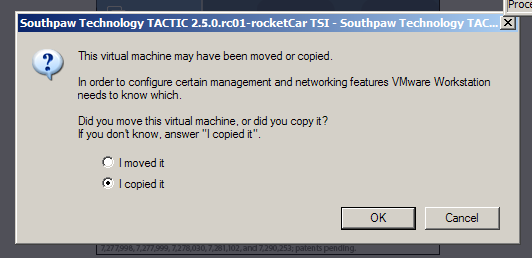

# TACTIC VM Setup and Install

The TACTIC VM lets you test a TACTIC server environment on your own computer. You can use VMware Player or Virtual Box to run the VM.

Download the VM from the community site <a href="http://community.southpawtech.com/tactic/community/link/downloads">downloads page</a>.

Get started by reading the Quick Start documentation from the community site.

## Login Info

There are two sets of login info to remember:

1.  VM Linux user

    user: root password: south123paw

2.  Samba share

    user: tactic password: south123paw

## VMWare Player Setup

**Download VMware Player or server**

The VMware player is a license-free player you can download from

**<http://vmware.com/download/player/> \[<http://vmware.com/download/player/>\]**

VMware currently supports Microsoft Windows XP, Windows Vista and many
flavors of Linux. To streamline the evaluation process, we chose the
Fedora Linux-based operating system to create the TSI virtual machine
image. (Although you will be running the VM on any of many supported
operating systems, you will see the Fedora Linux when you use the VM.)

**Download VMware Server**

The VMware server is a full-featured service for Virtual machines

VMware server is a service that allows users to run VMs silently in the
background. No window is needed, and the server can be configured to run
the VM on host machine startup. Additionally, there are several
interesting options that allow for more flexible operation of a VM.

-   **Web UI**

-   **Pause** The ability to pause a VM is useful for cycling the VM host.

-   **Snapshot a VM** The VMs current state can be saved and recalled in the future. Note that if the VM is reverted to a snapshot, then any changes
    that have occurred since the snapshot was taken will be permanently deleted.

-   **Change hardware** The VM can be modified to change hardware. For
    example, another network interface, or a USB interface

> **Note**
>
> The instructions for running a VM can be found in the VMware server
> documentation. Running the VM from VMware player is covered in this
> document.

**Networking**

When VMware software is installed, several new network interfaces can
become available, depending on the options selected during the
installation process. Although any one of the interfaces can be used to
connect to the VM, it is advised to install all three network
interfaces, as this allows the most flexibility

> **Note**
>
> Successful operation of a virtual machine may require some input from
> system administrators within a network environment.

-   NAT

    -   If it becomes necessary to isolate the VM on a host machine, then the
        NAT interface can be used to connect to the VM.

    -   Internet and LAN connectivity can be utilized through the NAT
        interface if the host machine is connected to an external network such
        as the internet or a LAN. Allowing the VM to communicate with a LAN may
        require changes to the routing system on the LAN. If this is a
        requirement, then bridged networking may be the better option.

    -   NAT is a complete network that originates at the host machine, and is
        a self-contained router with DHCP services. The VM, once run, will
        usually ask the host machine for an IP address to assign to a network interface. The host machine can then connect to the VM interface through
        this IP.

-   Bridged

    -   If there are machines other than the host machine that are required
        to connect to the VM, then the bridged connection should be used.

    -   The only requirement that bridged networking has is that there are
        appropriate services for the operation of the interface, such as DHCP on
        the host machines network. If these services do not exist, then the VM
        network interface needs to have manually set options.

-   Host Only

    -   To isolate the TSI completely, the “Host Only�? option can be used.

    -   Host Only is a complete network that originates at the host machine,
        and is a self-contained router with DHCP services. The VM, once run,
        will usually ask the host machine for an IP address to assign to a
        network interface. The host machine can then connect to the VM interface
        through this IP.

    -   The VM is completely isolated from the host machines LAN. There is no
        network connectivity, therefore no LAN or internet will be available on
        the VM.

After you start up the VMware Player, click on the **Open** option to
browse for a virtual machine.

Browse to where the unzipped VM is. Open the `TACTIC_VM_3.8.0.v04.vmx`
file. The TSI will start up in the VMware Player.

When you first start the VM, you are presented with a window asking
whether the virtual machine was moved or copied. Click the "I copied it"
button.

Start-up messages scroll by after the Linux kernel boots in the VM
window. After the boot-up is completed, you will see this prompt:

If you see this prompt, the TACTIC VM has started up correctly. If it
does not show an IP address (for example, a number like
"192.168.25.138"), it means the virtual machine has not picked up an IP
address from a DHCP server. This IP address is required, so you must
contact your IT department to fix this situation. (Refer to the
Troubleshooting Section.)

Write down the IP address and any names you see such as
"localhost.localdomain". (You will need this information in a next
step.)

In special evaluation situations, there is a requirement for more disk
space than has been allocated for a standard evaluation (i.e. a large
amount of assets are to be stored, then the TSI "assets partition" can
be expanded.

Steps to expand disk space on a VM

1.  Shut down TACTIC

    To shut down TACTIC, issue the command

    service tactic stop

2.  Unmount the "TACTIC" drive

    umount /home/apache

3.  Run the logical Volume expansion tool

    lvextend -L+2G /dev/mapper/VolGroup00-LogVol00

    This example command resizes the logical volume by +2 G, as seen in the
    command itself. The volume can be expanded to the total size of the
    virtual disk.

4.  Run the filesystem consistancy checker to make sure the filesystem
    is ok

    e2fsck -f /dev/mapper/VolGroup00-LogVol00

5.  Resize the filesystem on the logical volume

    resize2fs /dev/mapper/VolGroup00-LogVol00

6.  Re-mount the "assets" drive

        mount /home/apache/assets

7.  Restart TACTIC

        service tactic start

To make your evaluation easier, the TSI uses passwords that are easy to
guess and a Samba share. This could cause security issues, so your IT
department must be aware of your use of the TSI.

If at any point during the usage of the VM there is a need to reset the
VM back to its original state, simply delete or archive the directory
with the TSI data, and re-expand the zip file that was downloaded from
the community site.
