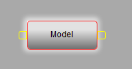
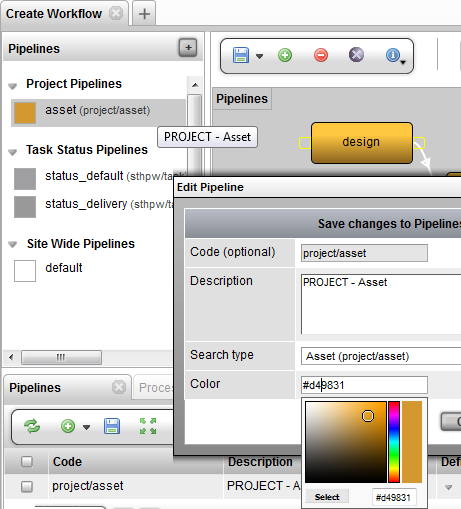

Workflow Editor
---------------

image:media/1_workflow_editor_overview.png[image]

*Introduction*

The Workflow Editor is a graphical tool in TACTIC used to interactively
create pipelines (workflows). It is a node-based tool which creates
processes in a pipeline and connects them. The Workflow Editor makes it
easier to create large complex pipelines to filter and process
information and file system flow.

The Workflow Editor is simple to use and similar to node base utilities
commonly found in other applications. Nodes can be created in the canvas
and connected together. Each node represents a process (with attributes
associated to it) and each connection represents information being
delivered from one process to the other. Together, the Workflow Editor
helps you create a definition of the pipeline document and drive much of
the information flow in TACTIC.

*Access the Workflow Editor*

Access the Workflow Editor by going to:

*Admin Views -> Project Admin -> Project Workflow*

When the option for "Has Pipeline" is selected during the registration
of the sType, this defines a default pipeline for that sType. This
pipeline can be found defined in the Workflow Editor in the sidebar
under *Project Pipelines*. To add a new pipeline manually, the select
the [+] icon in bottom panel of the Workflow Editor.

image:media/2_workflow_editor_pipelines_panel.png[image]

*Interface Walk Through*

The buttons at the top of the Workflow Editor allow various operations
on the canvas:

image:media/pipeline_tools.png[image]

* *Create:* Creates a new node on the canvas.
* *Delete:* Deletes the selected node.
* *Save:* Saves the current state of the pipeline to the database.
* *Clear:* Clears the canvas.
* *Properties:* Opens the Node Properties panel.

*Edit Properties of a Pipeline*

To edit the properties of a pipeline, first select a node in the
pipeline and then click on the *Edit Properties* button on the tool
shelf.

_____________________________________________________________________________________________________________________
*Note*

For more information regarding the Process Options, refer to the section
Project Workflow -> Pipeline Process Options
_____________________________________________________________________________________________________________________

image:media/7_workflow_editor_properties.png[image]

*Lay Out a Pipeline*

When you click the green plus button,
*Create*image:media/add_button.png[image], a new node will appear on the
canvas.

image:media/pipeline_node_insert.png[image]

Rename the node: Select the new node and press CTRL-LMB to rename the
node. Alternatively, right click and select *Rename Node* from the
context menu.

image:media/pipeline_node_naming.png[image]

Type in the new name for the node ("Model," in this example), and press
*Enter*.

Create another new node (called "Texture" in this example).

image:media/pipeline_nodes.png[image]

To create a connection between the two nodes, click on the handle on the
right side of the "Model" node. This will create a connector which will
follow the cursor.

image:media/pipeline_node_connector.png[image]

Click on the left handle of the "Texture" node to complete the
connection. Now, the 2 nodes are connected together. Once 2 nodes are
connected, they will stay connected unless the connector is selected and
deleted.

image:media/pipeline_node_connection.png[image]

It is also possible to have one node connect to more than one node. In
the following example, the "Model" process delivers to both the
"Texture" process and a "Rig" process:

image:media/Pipeline_node_tree.png[image]

*Pipeline Workflow Automation*

Repetition and daily components that make up a user's workflow can be
made easier through automation of notifications, file/directory naming
and triggering custom logic. Automations such as these can vary from
simply sending an email or automatically setting upstream and downstream
task statuses to running custom Python scripts and tools to encode
files, submit renders, generate previews, deliver files to clients, etc.

On the Workflow Editor's canvas, right-clicking on a node will bring up
the context menu where the automation interfaces can be loaded into the
lower half of the interface. These options include:

[width="100%",cols="50%,50%",]
|=======================================================================
|*Show Properties* |Loads the Node Properties window.

|*Show Triggers/Notifications* |Loads the Triggers and Notifications
setup Interface

|*Show File Naming* |Loads the Directory and File naming convention
setup Interface
|=======================================================================

________________________________________________________________________________________________
*Note*

Each of the menu options are explained in the "Project Automation"
section of the documentation.
________________________________________________________________________________________________

*Mouse and Keyboard Shortcuts*

When the cursor is over the canvas in the pipeline editor, the following
mouse and keyboard shortcuts are available:

[width="100%",cols="51%,49%",]
|=======================================================================
|*LMB* on a node |Select the node

|*LMB* on the empty canvas space |Clears selection

|*LMB + Ctrl* click on a node |Edits the name of the node

|*LMB + Shift* click on a node |Add node to selection

|*LMB + drag* on a node |Drags the node around the canvas

|*LMB + drag* on the empty canvas space |Pans around the canvas

|*LMB + Shift + drag* to form a selection box |Forms a selection box

|*LMB + Ctrl + drag* to the left or the right |Zooms in or out on the
canvas

|*DELETE* |Deletes the selected node(s)
|=======================================================================

*To Change Node Color*

To change the node color, go to the *Workflow Editor -> sidebar*

right click on the pipeline and select *Edit Pipeline Data*

Next, click on the color input field. A color swatch will pop-up. Select
the new color for this pipeline from the color swatch.

Another way to change the color is in the *Workflow Editor -> Pipelines
tab (panel at the bottom)* click on the *color* column and pick the
color from the color swatch.

image:media/5_workflow_editor_change_node_color_method_two.png[image]

*Pipeline Node Context Menu Options*

Right click on the pipeline node will display the following menu
options:

image:media/6_workflow_editor_node_context_menu.png[image]

[width="100%",cols="51%,49%",]
|=======================================================================
|*Add To Current Group* |Add the selected node to the current group

|*Rename Node* |Rename the current selected node

|*Delete Node* |Delete the current selected node

|*Delete Group* |Delete the group for the current selected node

|*Edit Properties* |Edit the properties for the current selected node

|*Show Triggers/Notifications* |Display the triggers and notifications
view in the bottom panel

|*Show Processes* |Display the processes in the bottom panel

|*Customize Task Status* |Create a custom task status pipeline for the
process (refresh the Workflow Editor to see it added to the sidebar)
|=======================================================================

[[task-status-pipelines]]
*Task Status Pipelines*

[[section]]

Task Status Pipelines are created in almost the same way as regular
Pipelines. except that in the new pipeline dialog, Task should be selected 
for Search Type. Nodes are created and joined together in the same way.
Each task has a pipeline_code attribute and by default it uses the built-in "task"
task status pipeline. When you specify a custom task status pipeline, the task's 
statuses will change accordingly. 

[[types-of-node]]
*Types of Node*

There are five different types of nodes with different shapes:
manual, action, condition, approval, and hierarchy nodes. Each of the
different nodes can enhance the effectiveness of the pipelines and be
used to fit the environment and behaviors of specific workflows. 

image:media/type_of_nodes.png[image]

[width="100%",cols="34%,33%,33%",]
|=======================================================================
|Type of Node |Representation |Description

|Manual Node | |Manual nodes are the
default nodes that represent tasks within a pipeline, users assigned to
a Manual node are expected to complete the task. Manual nodes usually
involve work that needs to be done, such as asset ingestion, or a
submission of assets being worked on.

|Action Node |image:media/action_node.png[image] |Action nodes can
automatically execute an action based on a script once the preceding
task is completed. For example, if its preceding Approval Node is
“Approved”, or a Manual Node is set to 'Complete', the action node will
be set off right away, and changes its following node will be set to
“Pending”.

|Conditional Node |image:media/conditional_node.png[image] |Condition nodes are
used when the path of a process needs to be determined by checking
specified conditions using a script. It can also automatically change
statuses of other nodes. The condition check should either return True
or False, or a list of the output streams. For example, if the
conditional checks return "False", it will set the status of the
previous node to 'Revise'.

|Approval Node |image:media/approval_node.png[image] |Approval nodes allow
assignment to user groups that are required to approve the process. If
the status of an Approval node is changed to 'Rejected', the preceding
task status will be changed from “Complete” to 'Revise' automatically.
Similar to other nodes, if the status is changed to 'Approved', the
following node will be in Pending status.

|Hierarchy Node |image:media/hierarchy_node.png[image] |Hierarchy nodes are
currently on the development roadmap.
|=======================================================================

[[triggers]]
*Triggers*

To open the Trigger and Notification editor, begin by selecting a manual
node. On the right side of the window there will be a Process
Configuration view. If this view is empty, simply save the pipeline and
click the node one more time.

From this view, the Trigger and Notification editor can be displayed by
clicking the View button beside Triggers or Notifications. This will
bring up a popup giving information about existing Triggers and
Notifications. To add a new one, press the plus button in the popup
window.

From here, add a name and description of the trigger, and choose the
event and action. The list of events includes common operations
performed on nodes (or tasks). For example, the checking in of a file,
the assigning of a task or the changing of a status can all cause an
event.

Actions are what happens when an event is triggered. Many Actions have
the ability to affect other tasks, and others have the ability to send
out notifications. 

image:media/trigger_setup.png[image]

Here are some examples of common Event - Action relationships:

* Changing a task status to Complete causes the next task's status to change to In Progress
* In the case of a Design task followed by a Review task: changing the
Design task's status to Complete changes the Review task's status to
Need Review
* Changing a Review task's status to Rejected changes the previous
task's status to Revise
* Assigning a task to a user sends a notification to that user
* Adding a note to a task sends a notification to a user group

Building on top of user-created pipelines, this trigger system allows
users to make use of powerful automation to make their projects run
smoother.

[[notifications]]
*Notifications*

Notifications are created in the same way as triggers. It's simply a
matter of selecting Send a notification under the Action section. From
here a user can choose to send the default message and type in mail
destinations and cc's. These two boxes can contain email addresses,
login codes and group codes. 

image:media/notification_setup.png[image]

The message can be customized also. To do so, uncheck Use Default
Message and fill in the Subject and Message text areas. A text-based
message can be entered, including variables related to the modified
item. Below is a table of common variables:

[width="100%",cols="50%,50%",]
|=============================================================
|Login of user that made the change |\{@GET(.login)}
|If a note is added, the note content |\{@GET(.note)}
|Name / Code of modified item |\{@GET(.name)} / \{@GET(.code)}
|If a note is assigned, the assignee |\{@GET(.assigned)}
|Status of the given task |\{@GET(.status)}
|If a task is changed, name / code of its parent |
\{@GET(parent.name)}

\{@GET(parent.code)}

|Process of modified task |\{@GET(.process)}
|Any column of modified item |\{@GET(.<column_code>)}
|=============================================================

For mail_to and mail_cc, you can use an email address or expression that 
optionally makes use of the current sobject. Let's say the sobject is a task,
the 'sobject' below is the environment variable.

[width="100%",cols="50%,50%",]
|=============================================================
|assignee of the task |@GET(sobject.assigned)
|supervisor of the task |@GET(sobject.supervisor)
|Email to ben and cindy regardless of the current task |@GET(sthpw/login[\'login\',\'in\',\'ben\|cindy'].login)
|Email to ben and cindy regardless of the current task |@SOBJECT(sthpw/login[\'login\',\'in\',\'ben\|cindy'])
|=============================================================

In order for notifications to be operational, two conditions have to be
met. First, the user that triggers an action that causes a notification
must have their email entered into their user profile. It is highly
encouraged that each user have their email entered upon their creation.
Secondly, the mail server of TACTIC | Workflow must be configured, which
is discussed in Section 8.3.

Note: If the user does not have an email entered into their user
profile, the notification will not be sent, but the action still goes
through.

*Advanced*

Behind the scenes, the pipeline is an XML text document. This document
is how TACTIC stores its representation of the pipeline structure of
nodes and connections.

Although it is rare to need to manually edit the pipeline XML structure,
it is available at the bottom of the Workflow Editor in the pipelines
table in the *Data* column.

Below is an example of the pipeline XML for the *Model -> Rig / Texture*
pipeline:

-----------------------------------------------------------------------------------------------
<?xml version='1.0' encoding='UTF-8'?>
<pipeline scale='100'>
  <process name='model' ypos='-95' xpos='-138'/>
  <process name='rig' color='blue' xpos='38' completion='80' task_pipeline='task' ypos='-165'/>
  <process name='texture' ypos='-51' xpos='42'/>
  <connect to='rig' from='model'/>
  <connect to='texture' from='model'/>
</pipeline>
-----------------------------------------------------------------------------------------------
